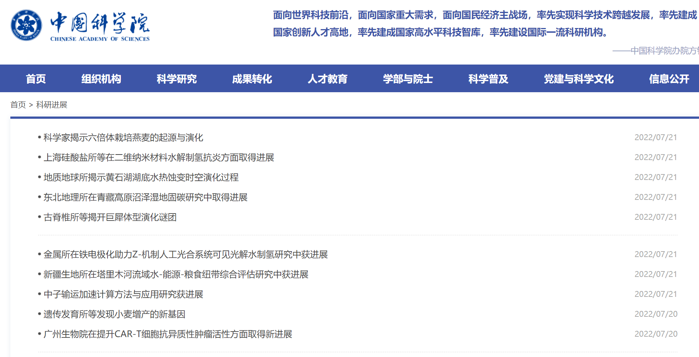
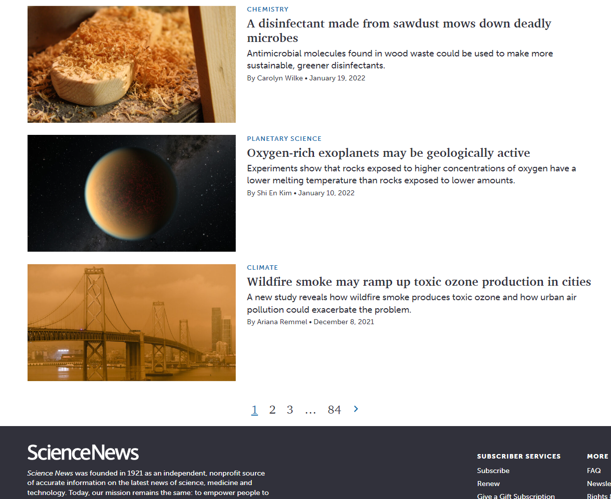
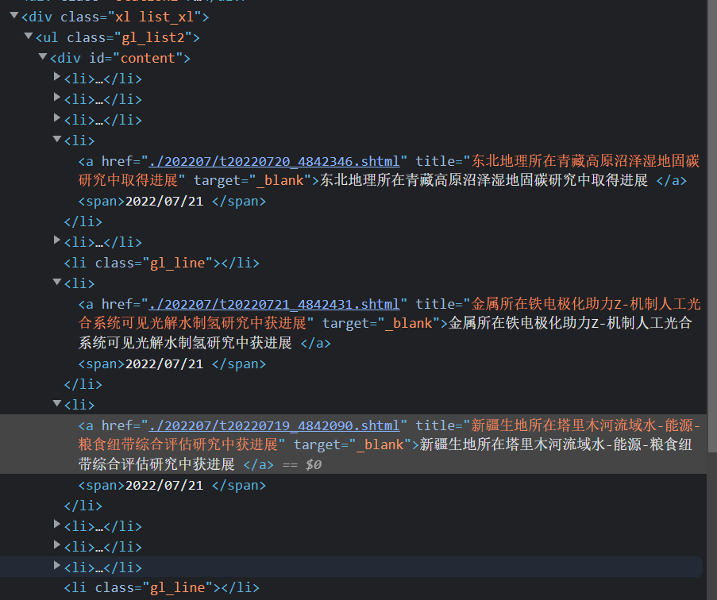
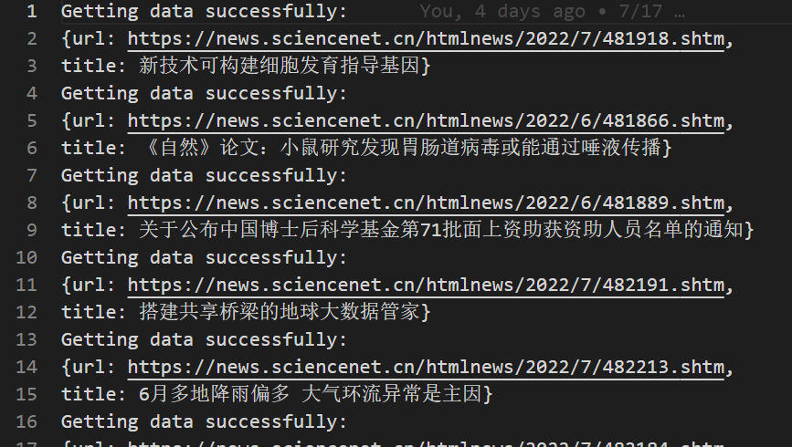
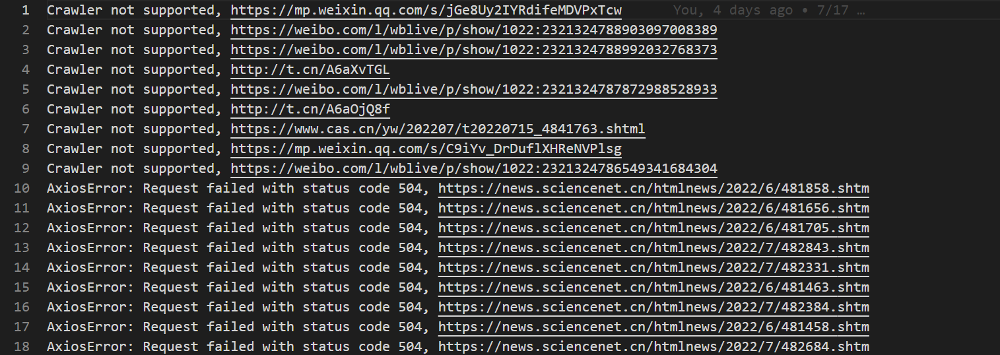
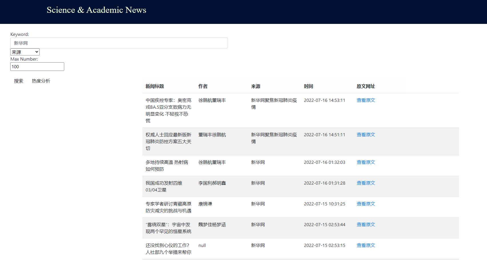
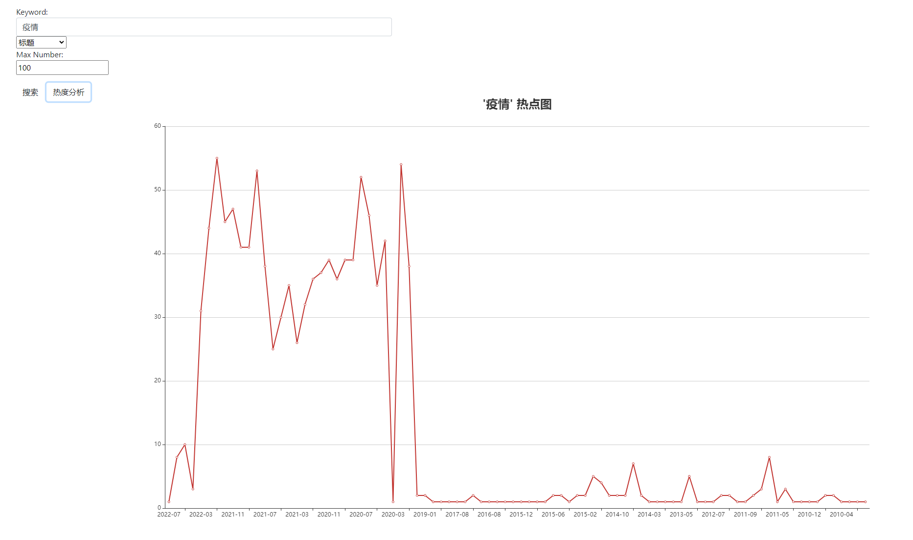

[Github Link](https://github.com/Ghostlikei/Crawler_ECNU)

[Presentation Slides](https://github.com/Ghostlikei/Crawler_ECNU/blob/main/src/%E6%9C%9F%E6%9C%AB%E5%A4%A7%E4%BD%9C%E4%B8%9A%E6%8A%A5%E5%91%8A.pptx)

## Requirements

- News Crawler and Query Website for Crawled Results

1. Select 3-5 representative news websites (e.g., Sina News, NetEase News, or authoritative websites in specific vertical fields such as Snowball Finance and Eastmoney in the economic domain, or Tencent Sports and Hupu Sports in the sports domain). Develop web crawlers to analyze the news pages of these websites, extracting structured information such as encoding, title, author, time, keywords, summary, content, and source, and store this data in a database.

2. Build a website to provide categorized full-text search of the crawled content, along with time-based heat analysis for the searched keywords.

### Objectives

Develop a news crawling project that provides full-text search and keyword time-based heat analysis.

- Proposed technologies:
  - Use **HTML** and **JavaScript** for front-end development.
  - Use **Node.js** for back-end control.
  - Due to technical constraints, the project will be developed on a **Windows 10** platform.

- **Crawler Component**:
  - Attempt to implement a multi-threaded crawler; if unsuccessful, use a single-threaded approach temporarily.
  - Encapsulate crawlers for each website and control them independently.
  - Store crawled content in a database, considering **MySQL** as the back-end database.
  - Export crawl logs for manual control and monitoring of entries.

- **Front-End Website**:
  - Provide search functionality, keyword time heat analysis charts, and query results that display both charts and a list of news articles on the webpage.
  - Use **ECharts** components to render charts.

## Crawler Component

- The design of the crawler aims to perform a one-time crawl of the entire website, prioritizing maximum efficiency.

#### **STEP 1**: Selection of Websites to Crawl

The vertical domain is defined as websites in the **science and academic** field. Through browser search functionality, three **mainstream and structurally similar** news websites were selected: [ScienceNet China](https://www.sciencenet.cn/), [Chinese Academy of Sciences](https://www.cas.cn/), and [Science News](https://www.sciencenews.org/) for supporting English searches.

The primary reasons for selecting these three websites are:
- Similar structures (all use list-based formats),
- (Nearly) no anti-crawling measures,
- Sufficient volume of news articles.





- The more anti-crawling measures a website has, the more components the crawler requires, increasing design complexity and stability control demands.

#### **STEP 2**: Estimating the Number of Entries to Crawl

This step is crucial because, given time constraints, the scale of data determines the crawler design pattern.

- **ScienceNet**  
  - [Top News](https://news.sciencenet.cn/topnews-2.aspx): All entries, approximately 75,849 items.

- **Chinese Academy of Sciences (CAS)**  
  - [Scientific Progress](https://www.cas.cn/syky/index.shtml): Estimated 3,000+ items.  
  - [Daily Science](https://www.cas.cn/kj/index.shtml): Estimated 3,000+ items.

- **Science News** (categorized by topic, with some overlap): Estimated 27,000 items.  
  - [Chemistry](https://www.sciencenews.org/topic/chemistry/page/2): 900–1,000 items (last page: 84).  
  - [Earth](https://www.sciencenews.org/topic/earth/page/2): 4,000 items (last page: 299).  
  - [Humans](https://www.sciencenews.org/topic/humans/page/2): 8,000 items (last page: 704).  
  - [Life](https://www.sciencenews.org/topic/life/page/2): 6,000–7,000 items (last page: 582).  
  - [Math](https://www.sciencenews.org/topic/math/page/2): 700–800 items (last page: 64).  
  - [Physics](https://www.sciencenews.org/topic/physics/page/2): 2,000 items (last page: 188).  
  - [Science & Society](https://www.sciencenews.org/topic/science-society/page/2): 1,200 items (last page: 103).  
  - [Space](https://www.sciencenews.org/topic/space/page/2): 3,000 items (last page: 279).  
  - [Tech](https://www.sciencenews.org/topic/tech/page/2): 1,200 items (last page: 106).

#### **STEP 3**: Crawler Design Based on Data Scale and Website Structure

- The estimated total number of entries exceeds 100,000, making multi-threaded crawling highly advantageous.
- Since all three websites follow the **list page → content page** structure, a reusable crawler framework can be designed.



#### **STEP 4**: Selecting Tools and Writing the Crawler

- All crawlers are divided into three components: **webpage fetching**, **data parsing**, and **data storage**.

- Considering the use of high-performance multi-threaded crawlers, the `axios` module is used for the webpage fetching component.

- For the parsing library, `cheerio` is chosen, as it is better encapsulated than `jquery`. The choice of parsing library is flexible, as long as its efficiency exceeds the crawling speed.

- The database used is a local **MySQL** instance. As previous projects primarily used NoSQL databases, this is a first attempt with SQL databases, aimed at improving proficiency in writing SQL queries and operations.

- Logs are exported for all crawled entries (both successes and failures) to facilitate manual intervention when necessary.

**Success Log**



**Failure Log**



#### Crawler Content Demonstration

Using ES8's new `async/await` feature simplifies promise chaining significantly.

The following crawler is just a sample; the fully functional project is available in the personal GitHub repository.

- **Fetching List Pages**

```javascript
async function getNewsHtml(listUrl){
    try{
        const resp = await axios.get(listUrl,config);
        return resp.data;
    }
    catch(err){
        fs.writeFileSync("./error_log.txt",`${err}, ${listUrl}\n`,{flag:"a+"});
    }
}
```

- **Parsing List Pages**: Returns an array containing the URLs of content pages. The `cheerio` selector syntax is identical to `jquery`.

```javascript
async function getNewsLinks(listUrl){
    try{
        const html = await getNewsHtml(listUrl);
        const $ = cheerio.load(html);
        let anchor = $("div ol li div h3 a"); //Fetch link
        
        const links = anchor.map((i, ele) => {
            const href = ele.attribs["href"];
            return href;
        })
        console.log(`Fetching page: ${listUrl}`);
        return links;
    }
    catch(err){
        fs.writeFileSync("./error_log.txt",`${err}, ${listUrl}\n`,{flag:"a+"});
    }
    
}
```

- **Separate Async Function for Parsing and Storing Content Pages**

```javascript
async function getData(newsUrl){
    try{
        let SUCCESS = true;
        const resp = await axios.get(newsUrl, config);
        const $ = cheerio.load(resp.data);
        // Omit data part
        let sql = `INSERT INTO sciencenews VALUES("${title}", "${author}", "${source}", "${time}", "${article}", "${url}", "${essay}");`;
        connection.query(sql, (err, result) =>{
            if(err){
                SUCCESS = false;
                fs.writeFileSync("./error_log.txt",`${err}, ${newsUrl}\n`,{flag:"a+"});
                return;
            }
        }) // Store Data
        if(SUCCESS) fs.writeFileSync("./crawl_log.txt",`Getting data successfully:\nurl: ${url}\n`,{flag:"a+"});
        return {}; //return data json
    }
    catch(err){
        fs.writeFileSync("./error_log.txt",`${err}, ${newsUrl}\n`,{flag:"a+"});
    }
}
```

- **Parsing Method**: Combines `cheerio` selectors with regular expressions for greater efficiency.

To identify elements for parsing, open the browser, press `F12`, right-click on the element, and choose "Inspect." Then, right-click on the selected content, choose "Copy Selector," and paste it into the selector. While this method is quick, its compatibility is inferior to manually written selectors. Whenever possible, prefer manually written selectors.

Selector and regex debugging should be done in a separate script. This allows for lightweight crawler testing, making the process faster and more efficient.

Below is a parsing example to illustrate the thought process behind implementation.

```javascript
let title = $('table tbody tr:nth-child(3) td').text().replace(/(^\s*)|(\s*$)/g, ""); // Fetch Title, Remove blanks
let source = $('tbody tr:nth-child(1) td div a').text(); // Fetch Source

let author = '';
let info = $('tbody tr:nth-child(1) td[align="left"] div:nth-child(1)').text().replace(/(^\s*)|(\s*$)/g, "");
if (info.slice(0,2) !== '作者'){
    author = null;
} else {
    author += info.match(/：.*[\u6765][\u6e90]：/g)[0]; // Use RegEx to get author info, apply unicode for Chinese
    author = author.replace(/\uff1a/g,"").replace(/\u6765\u6e90/g, "").replace(' ',''); // Remove Extra Elements
}

let time = info.match(/\d+[/-]\d+[/-]\d+\s\d+[:]\d+[:]\d+/g); // Avoid Index Error, Check the time first
if(!time){
    time = info.match(/\d+[/-]\d+[/-]\d+/g)[0]; // Fetch Time
} else {
    time = info.match(/\d+[/]\d+[/]\d+\s\d+[:]\d+[:]\d+/g)[0];
}

let article = $('p').text().replace("\t", ""); // Fetch Article
let url = newsUrl;
```

The design philosophy for the parsing function is to maximize compatibility, but it does not aim to accommodate every page perfectly or ensure all information is flawlessly extracted. This is simply impractical. Hence, the use of `try` and `catch` blocks, along with exporting logs, becomes essential.

- Finally, an asynchronous function combines the two previous functions into a cohesive workflow.

```javascript
async function fetchAll(listUrl){
    const links = await getNewsLinks(listUrl);
    try{
        const proms = links.map((link) => {
            return getData(links[link]);
        });

        return Promise.all(proms);
    }
    catch(err){
        fs.writeFileSync("./error_log.txt",`${err}\n`,{flag:"a+"});
    }
```

At this point, the entire promise chain is complete: fetching list pages → parsing list pages → crawling each page → parsing pages → storing data.

- Finally, a main function and relevant parameters are used to control the entire crawler program.

Prior to this, JavaScript did not have a built-in `sleep` function. If interval control is needed, an asynchronous `sleep` function must be manually implemented.

```javascript
const sleep = (timeout) => {
    return new Promise((resolve)=>{
      setTimeout(()=>{
        resolve();
      }, timeout)
    })
}
```

The main function is finally controlled through parameters.

```javascript
let start_page = 1;
let end_page = 100;
let wait = 25000; // Set Sleep ticks to avoid i/o overload
let number = 10; // thread num = number * links per page
async function main(){
    for(let j = 1; j <= 1000; j++){
        for(let i = start_page; i < start_page+number; i++){
            fetchAll(`https://www.sciencenews.org/topic/tech/page/${i}`);   
        }
        await sleep(wait);
        if(start_page-number >= end_page){
            console.log("抓取结束！");
            connection.end();
            return;
        }
        start_page += number;
    } 
    console.log("抓取结束！");
    connection.end();
}
main();
```

#### Crawling Efficiency

For example, with 20 entries per page and crawling 20 pages at a time with a 20-second interval, theoretically, 72,000 entries can be crawled in one hour.

The number of pages to crawl depends on the server's performance, while the crawling rest time depends on the transmission speed between the local and remote servers.

#### Crawling Results

With three crawlers running simultaneously, a total of 61,614 entries from ScienceNet, 13,227 entries from the Chinese Academy of Sciences' official website, and 34,309 entries from ScienceNews were crawled in one hour. The failure rate is estimated to be around 6,000 entries. A total of 109,510 entries were stored in a single table, named `sciencenews`.

The reason they were not stored separately is that the crawled websites are not **news source** websites. If you need to find the corresponding news sources, you can search using the `source` keyword.

#### Additional Notes

- During the presentation, the instructor mentioned the issue of thread deadlock. Specifically, running several hundred or thousand threads simultaneously can lead to thread deadlock. Although this issue did not occur during the actual crawling process, it is a known problem. Despite implementing many safety measures in the code, such as using safer `async/await` for logging crawls, setting timeouts, etc., problems can still arise if the thread states are not directly monitored. A potential solution might be to write a function that monitors thread status or create a thread pool for handling operations.

- This crawler can only handle websites with poor anti-scraping mechanisms. If faced with techniques such as data poisoning, IP blocking, or verification, more components, such as IP pools, validation components, and automation tools, will be needed. The approach must be tailored to each specific website.

- For learning about web scraping, it is recommended to read books on the subject. From personal experience, JavaScript, due to its language features and front-end compatibility, is the most convenient for writing simple crawlers.

## Website Architecture

- The `express` framework is used to connect the front-end and back-end. Specific operations can be referenced from other tutorials. It is important to install all the necessary modules for both the front-end and back-end into the express project, as this improves code reusability.

- In fact, the framework part was attempted for a long time. Initially, the plan was to implement the page purely with `ajax`. After several days of failure, the framework was used. Of course, if time permits, one can learn some mainstream frameworks like React, Vue, or Angular, which are all excellent options.
- A total of three CDNs are required for this project: jQuery, Bootstrap, and ECharts. The latest compiled versions can be found on their official websites.

#### Query List

- **Back-end Part**

Some issues were encountered during implementation, such as needing to add quotation marks around the `%` in `LIKE` queries, and being cautious of the order of conditions in SQL statements, etc.

It is recommended to test the correctness of SQL statements in the local MySQL command line. This helps to detect errors more easily. Personally, I prefer to use `console.log` to output results during debugging, as using breakpoints is not always intuitive when working with both JS and HTML. However, if you are comfortable with debugging, using a debugger is the best approach.

```html
//html组件，查询变量全部放在表单里面
<div class="searchContainer">
        <form role="form">
            <div class="form-group">
                <br>Keyword:<br>
                <input type="text" class="form-control" id="keyword" placeholder="请输入关键字">
                <select class="form-select" aria-label="Default select example">
                    <option selected>Select Item</option>
                    <option value="author">作者</option>
                    <option value="title">标题</option>
                    <option value="article">正文</option>
                    <option value="source">来源</option>
                </select>
                <br>Max Number:<br>
                <input type="number" id="number" placeholder="最大查询数量">
            </div>
            <button type="button" id="search" class="btn btn-default">搜索</button>
            <button type="button" id="chart" class="btn btn-default">热度分析</button>
        </form>
    </div>
```

- **Front-end Part**

```js
$(document).ready(function() {
        $('button[id="search"]').click(function() {
            $.get('/process_get?keyword='+$('input:text').val()+","+item, function(data){
                $('table').empty();
                
                $("table").append('<tbody>');
                $("table").append('<tr class="news table-light"><th>新闻标题</th><th>作者</th><th>来源</th><th>时间</th><th>原文网址<a>        </a></th></tr>');//写出标题栏
                let cnt0 = 0;
                
                for (let list of data) {
                    // 对数据库当中的数据进行一定的处理
                    let cnt1 = 0;
                    let table = '<tr class="news table-hover"><td>';
                    for(let element of Object.values(list)){
                        if(cnt1 <= 1){
                            table += (element + '</td><td>');
                        } else if(cnt1 === 2){
                            table += (element.replace(/[\s]/g, "") + '</td><td>');
                        } else if(cnt1 === 3){
                            table += (element.replace('T'," ").replace(".000Z","") + '</td><td>');
                        } else {
                            table += (`<a href="${element}">查看原文</a></td><td>`);
                        }
                        cnt1++;
                    }
                   
                    $("table").append(table + '</td></tr>');
                    cnt0++;
                    if($('input[type="number"]').val() > 0){
                        if(cnt0 >= $('input[type="number"]').val()) break;
                    }
                }
                $("table").append('</tbody>')

                
            });
        });
    });  
```

- Actual Effect



#### Heat Analysis

- **Back-end Part**

The data is grouped directly using SQL queries, without the need for additional scripts to process the data.

```js
router.get('/chart', (req, resp) =>{
  let ori = req.query.keyword.split(",");
  let arg = ori[0];
  let item = ori[1];
  let sql = `SELECT DATE_FORMAT(upload_time, '%Y-%m') AS date, COUNT(*) AS num\
  from sciencenews where ${item} like '%${arg}%' GROUP BY date  ORDER BY upload_time DESC`;
  mysql.query(sql, (err, result, fields) =>{
    resp.writeHead(200, {"Content-Type": "application/json"});
    resp.write(JSON.stringify(result));
    resp.end();
  });
});
```

The `date_format` function is used for grouping, and the `count` function is used to calculate the quantity. Finally, the returned values are sorted in reverse chronological order.

The second parameter of `date_format`, `'%Y-%m'`, is the grouping criterion, which can be modified via the front-end interface. Due to time constraints, this feature was not implemented.

- **Front-end Part**

```js
$(document).ready(function() {
        $('button[id="chart"]').click(function() {
            $.get('/chart?keyword='+$('input:text').val()+","+item, function(data){
                $('table').empty();
                var chart = echarts.init(document.getElementById('main'));
                var x_axis = [];
                var y_axis = [];
                for(let list of data){
                    x_axis.push(list.date);
                    y_axis.push(list.num);
                }
                var option = {
                    title:{
                        text: `'${$('input:text').val()}' 热点图`,
                        x: 'center',
                        textStyle:{
                            fontSize: 24
                        }
                    },
                    xAxis:{
                        type:'category',
                        data:x_axis
                    },
                    yAxis:{
                        type:'value'
                    },
                    series:[
                        {
                            type:'line',
                            data:y_axis
                        }
                    ]
                }
                chart.setOption(option);
            });
        });
    });  
```

- Actual Effect



