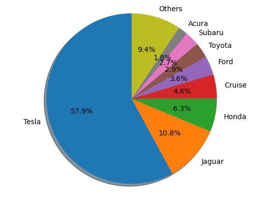
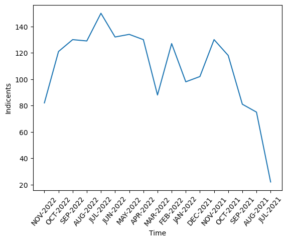
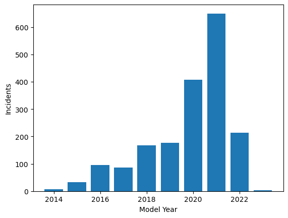
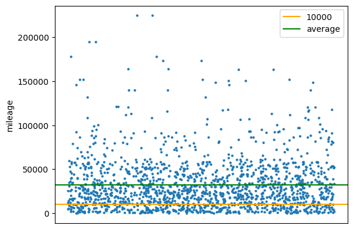
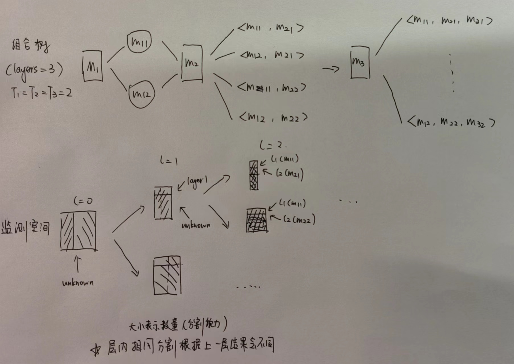

[Github Link](https://github.com/Ghostlikei/IntroDaSE/blob/master/Project/code.ipynb) 

[Presentation Slides](https://github.com/Ghostlikei/IntroDaSE/blob/master/Project/pre.pdf)

## Abstract

Commercial autonomous driving is a trending field. However, the increasing number of autonomous driving accidents has raised public concerns. This experiment adopts a standard data lifecycle approach to pinpoint the issues using modeling and data mining techniques. Based on an authoritative accident statistics dataset, the study begins by slicing and cleaning the data to structure accident records, followed by data visualization to explore the fundamental distribution patterns of accidents. Using **Root Cause Analysis (RCA)**, the study investigates the **maximum segmented combinations**, autonomously establishes, researches, and implements a search tree model, applies **dimensionality reduction** and **search tree pruning optimization**, and performs **ResultRanking** to successfully compute the optimal combination. This approach reduces the search space from **1m+ to tens of 10k+**, achieving a pruning rate of **98.78%**.

## Research Background

In recent years, purchasing and driving new energy vehicles (NEVs) has become a trend. With technological advancements, more high-tech companies have entered the NEV and autonomous driving arena, aiming to develop environmentally friendly and human-driving-replacing energy and automation technologies.

However, as commercial autonomous driving technology has only started its rollout in the past two years, public concerns about its **safety** persist. This concern is not unwarranted. According to SAE International standards, autonomous driving can be classified into the following stages:

- **Level 0** — no automation
- **Level 1** — hands on/shared control
- **Level 2** — hands off
- **Level 3** — eyes off
- **Level 4** — mind off
- **Level 5** — steering wheel optional

Currently, commercial autonomous driving technologies are primarily at Levels 2–3, representing Advanced Driver Assistance Systems (**ADAS**), which cannot fully replace human decision-making and driving. Meanwhile, due to its proliferation, accidents caused by autonomous vehicles have become frequent in recent years. Issues with models and quality are among the root causes of these accidents.

This study, from a data science perspective, aims to identify the root causes of accidents using datasets, data processing, and data mining techniques, focusing on accidents caused by ADAS models.

## Dataset Description

The implementation requires detailed statistics on autonomous driving accidents. In addition to standard accident data such as time, location, and outcomes, it must include data related to **autonomous driving assistance models**. These data are divided into two categories:

- External factors, such as weather conditions and lighting, which affect sensor judgments.
- Internal factors, such as sensor data and mileage, which influence the vehicle's monitoring capabilities.

Alongside ensuring the completeness of the above data, the dataset must also be **authoritative**. As this research investigates the safety of commercial models, **real-world highway data** is required rather than research or factory test data.

### Data Source

- [NHTSA](https://www.nhtsa.gov/laws-regulations/standing-general-order-crash-reporting), National Highway Traffic Safety Administration (NHTSA), USA


The dataset, provided by the U.S. government, is the only authoritative and standardized source of its kind. It is collected using the U.S. standard traffic accident statistical paper reports and carries **legal significance**, satisfying the above requirements. Simultaneously, the publicly displayed portion of the data has been anonymized to protect **data security**. The dataset, spanning from June 2021 to November 2022, is the first standalone dataset focusing on autonomous driving accidents, demonstrating strong **timeliness and authority**.

The dataset is in `csv` format and requires no further preprocessing.

### Data Preprocessing

#### Data Slicing

Using the `pandas` library's `DataFrame` class, the CSV data is directly loaded and **relationalized**. To facilitate subsequent processing, individual factors are sliced, and data clearly unrelated to the causes, such as reporter information and VIN codes, are removed. As there are 122 entries, they are first printed and sliced by index. Below is an example code snippet:

```python
DATA_PATH = "./datasets/aggregated_data.csv"

df1 = pd.read_csv(DATA_PATH)
# get heads of columns
info_draft = open("./info.txt", "w")
for head in df1.columns:
    info_draft.write(str(head))
    info_draft.write("\n")
info_draft.close()

# Sample of items
CPMove = df1.loc[:, "CP Pre-Crash Movement"] # item vector
CPContactArea = df1.iloc[:, 72:83]# item matrix
```

The retained factors are as follows:

- Reporting Company (Make)
- Reporting Month (Report Submission Date)
- Year of the Automated Model Used (Model Year)
- Mileage (Mileage)
- Time of Incident (Incident Time (24:00))
- Type of Roadway: Highway or Small Road (Roadway Type)
- Roadway Conditions (Roadway Surface)
- Speed Limit (Posted Speed Limit (MPH))
- Lighting Conditions (Lighting)
- Weather Conditions (Weather Matrix)
- Object Collided With (Crash With)
- Automated Action Before Collision (CP Pre-Crash Movement)
- Pressure Sensing Contact Area (CP Contact Area Matrix)
- Airbag Deployment Triggered by Sensors (SV Any Air Bags Deployed?)
- Pre-Crash Speed Detected by Sensors (SV Precrash Speed (MPH))
- Sensor Contact Area (SV Contact Area Matrix)

#### Data Cleaning

Anomalous information in the entries is removed and replaced with blanks. Missing values are filled with placeholders using the `fillna()` method. Further cleaning is not required at this stage, as specific handling methods will be determined based on the model setup.

## Data Statistics and Visualization

The statistical tools use the `value_counts()` method from the `DataFrame` class, and plots are created using the `matplotlib` library. The following data represent **accident distribution charts**, not market distribution charts.

- Pie Chart of Reporting Entities

The method computes statistical data and converts it to percentages by multiplying by a normalization factor $\eta$. Categories with less than 1.8% of the total are grouped into an "Others" category to prevent overcrowding of low-sample data, improving the visual clarity of the pie chart.



It is evident that Tesla-manufactured autonomous vehicles have the highest accident rate, which can be attributed to their leading sales figures.

- Line Chart of Accidents by Month



The time distribution is relatively uniform, with a peak in July 2022 and a drop in July 2021. This is likely because the data collection may not have started in July, and earlier data was not standardized according to this criterion.

- Histogram of Model Years



The model years are primarily concentrated after 2020, aligning with the timeline of autonomous driving research.

- Mileage Distribution Chart

Outliers with excessively high or low mileage are removed. A **10k mile** line is drawn to indicate vehicles with **low mileage**, and an **average line** is added to distinguish distributions above and below the average mileage. Since the data only involves one-dimensional mileage, random scatter points are applied along the x-axis and hidden to enhance the clarity of the visualization.



It can be observed that most accidents occur with autonomous vehicles having medium to low mileage, particularly with a dense cluster of points below the average line.

## Root Cause Analysis

In simple terms, RCA primarily studies the **combinations** of factors to identify the root causes of problems. It enables the **elimination of irrelevant factors** and the evaluation of the **impact of combinations**.

The factor combination problem is an **NP problem**. Assuming there are $n$ factors, and each factor has only two possible outcomes, True/False, the search space has at least $O(2^n)$ possibilities. The size of the search space grows exponentially with the number of factors $n$, leading to a very large computational cost. However:

Currently, there are two main fast algorithms for addressing this issue:

- Association Rule Mining
- Heuristic Search

Since multi-classification results from neural networks are not currently satisfactory and considering personal capabilities, this experiment adopts the second method, building a **search tree** to address this NP problem.

### Model Construction

#### Mathematical Model

- **Monitoring Space Construction**

Define an automation target $A$, where the automation operates based on a factor sequence $K$. The **correlations between factors are unknown**, and they exhibit a **time axis distribution**. Each factor belongs **exclusively** to its own **distribution space** $\mathbb{T}$, not shared with others:

$$
K = \{k_1, k_2, ..., k_n | k_i = f_i(timeline)\}
$$

In practical scenarios, the monitoring functions are discrete. Each factor's observed values $M_i$ can be represented as a vector:

$$
M_i = \{m_{ij}\}, m_{ij} \in \mathbf{Range}(f_i(t_j)) = \mathbb{T}
$$

Thus, the monitoring matrix space $M$ is defined as:

$$
M = (M_1, M_2, ..., M_n)
$$

- **Monitoring Space Segmentation**

Assume the number of factors in the monitoring space represents the **levels**, and the possible distributions of each factor define its **dimensionality**.

If the dimensionality of a factor is $u$, its distribution space can be segmented into $u$ distinct **monitoring subspaces**, each with a **unique value**:

$$
M_i = (M_{i1}, M_{i2}, ..., M_{iu}), \mathbf{set}(M_{ij}) = \{a\}, a \in \mathbb{T}
$$

At the **next level**, the distribution space and dimensionality of the monitoring space for that level reduce to 1, as the distribution space has already been segmented into $u$ subspaces.

**Monitoring Space Segmentation Theorem**: The monitoring space at level $i$ is the direct sum of all non-singular subspaces. This theorem holds by definition.

- **Combination**

The monitoring subspaces of the current level are combined with the subspaces of the previous level. Ultimately, the dimensionality of each monitoring factor reduces to 1, forming a valid combination.

Each **segmented** level contributes its segmentation results to the **combination sequence**, where the **length of the valid combination sequence equals the number of levels**.

Below is an illustrative diagram.



- **Valid Space Ranking (**ResultRanking**)**

This step evaluates which segmentation methods within the valid combination space are **optimal**, based on the criterion of **combination segmentation power**, and ranks them accordingly.

- **Single-Factor Segmentation Power (**Isolation Power**)**

This metric evaluates the mapping of segmentation results within a single level of the monitoring space, transforming the segmentation distribution into a measurable score.

The evaluation function must possess the following mathematical properties: when the distribution is **uniform**, segmentation power is at its **lower bound**; when the distribution is **degenerated**, segmentation power is at its **upper bound**. The function value must vary monotonically with the segmentation power:

$$
\begin{aligned}
&f:T\rightarrow R\\
&L=\max f(M) \Longrightarrow p(M)=U(0,1)\\
&H=\max f(M) \Longrightarrow p(M)=(0,0,...,1,...,0)
\end{aligned}
$$

- **Overall Factor Segmentation Power**

This evaluates the valid combination space using a function with properties similar to single-factor segmentation power, as a distance measure from the **unsegmented combination**:

$$
\begin{aligned}
&g:T^n\rightarrow R\\
&L=\min g(M) \Longrightarrow \min dist(L,M) ,M=L \\

&H=\max g(M) \Longrightarrow \max dist(L,M) 
\end{aligned}
$$

Thus, this function is an abstract concept requiring the determination of a **reasonable distance function**.

The above defines the mathematical model, properties, and terminology of the search tree, facilitating the description of subsequent processing steps.

#### Code Interface


- **Constructing the Search Tree Node Class**

We define the hierarchy using the factor slices from the data preprocessing stage. Each node, along with its contained information and methods, is implemented in a `class search_node`. The search process is then executed recursively. The following details the implementation process.

- **Information Contained in Each Node**

The monitoring matrix does not need to be replaced by numerical values. However, to minimize spatial overhead, a **mapping table** must be established to associate the distribution space $\mathbb{T}$ with its corresponding numerical representation, using the `enum()` operation. Additionally, -1 is designated to represent "no segmentation."

```python
class search_node:
    # search_mat: only include this layer and next ones
    # For example, depth = 1, only includes prev_mat[1:]
    # given_size: how many items remaining from pre-selectTree
    # given_iso: Sum of pre isolation powers
    # pre state: Result of pre-selectTree
    def __init__(self, 
                search_mat, 
                depth, 
                given_size, 
                given_iso, 
                pre_state, 
                 
                ## pruning parameter
                iso_threshold = 0.89, 
                size_thershold = 3):
```

- **Segmenting the Monitoring Space and Obtaining Distributions**

The designed algorithm uses known distribution types to create a **distribution array** and a **segmentation position record matrix**.

With a **single traversal**, it can efficiently perform **distribution statistics**, **probability calculation**, and **segmentation matrix generation**.

```python

def get_distribution(self):
        # Get the distribution first
        for i in range(self.attr_type):
            self.distri.append(0)

        # Only need to travel once through
        for i in range(self.given_size):
            self.distri[self.layer[i]] += 1
            self.mat_for_slice[self.layer[i]].append(i)
        
        for i in range(self.attr_type):
            self.amount_distri.append(self.distri[i])
            self.distri[i] /= self.given_size

```

- **Calculating Isolation Power**

The single-factor segmentation power function in this experiment uses **information entropy** as the metric, representing the **increase in information** given a distribution, and satisfying the assumed conditions:

$$
\mathrm{H}(X) = \sum_i \mathrm{P}(x_i) \mathrm{I}(x_i) = -\sum_i \mathrm{P}(x_i) \log_b \mathrm{P}(x_i)
$$

For degenerate distributions, the minimum value is directly assigned. To prevent extreme values of information entropy, a lower bound of 0.5 is used as the measure.

```python
def iso_power(self):    
    sum = 0
    for i in range(self.attr_type):
        temp = self.distri[i]
        if temp == 0 or temp == 1:
            return 0.5   
        sum -= temp*(np.log2(self.distri[i]))
    
    return sum
```

- **Segmenting the Monitoring Matrix**

Using the previously generated segmentation position record matrix, the current monitoring matrix is sliced in preparation for entering the next level of the combination tree.

```python
def slice_mat(self):
    for res_index in range(self.attr_type):
        index_mat = []
        for i in range(len(search_mat) - 1):
            layer = i + 1
            layer_temp = []
            for j in range(len(self.mat_for_slice[res_index])):
                layer_temp.append(search_mat[layer][self.mat_for_slice[res_index][j]])
            index_mat.append(layer_temp)
        self.sliced_mat.append(index_mat)
```

- **Lower-Level Search**

This section is represented in pseudocode due to its length and the absence of pruning strategies at this stage.

A critical point is that besides sub-monitoring matrices, **no segmentation** is also considered a type of segmentation and must be included in the next level of the combination tree.

A **preorder DFS** search is used. Since the algorithm requires traversing the entire search tree, the traversal method can be replaced with alternatives such as BFS in a single-threaded context without impacting search efficiency.

```python
def succeed(self):
	if self.depth == bottom:
		add (iso, state_vec) into unranked_result
	# If this Node is A->B, and B has isolation, branch A->b1->C,..., A->bn->C, A->C
	self.slice_mat()
    for i in range(self.attr_type):
    new_node = search_node(self.sliced_mat[i], 
                            self.depth + 1, 		
                            self.amount_distri[i], 
                            self.given_iso + node_iso_power, 
                            self.pre_state + [i])
    new_node.succeed()
    
    skip_level_node = search_node(search_mat[self.depth + 1:], 
                                    self.depth + 1, 
                                    self.given_size, 
                                    self.given_iso + 1, 
                                    self.pre_state + [-1])
    skip_level_node.succeed()
```

- **Algorithm**

After constructing the search node class, the algorithm takes the input matrix and begins the search from the root node.

```python
begin_node = search_node(search_mat, 0, length, 0, [])
begin_node.succeed()
```

### Data Processing: Dimensionality Reduction

After constructing the model, the next step is to address the **input monitoring matrix**. Since the factors were already sliced during data preprocessing, the focus is on the following aspects:

- **Dimensionality of Factors**

Dimensionality must be minimized while retaining information, a process referred to as **granularity analysis** in RCA.

  - If the granularity is too coarse, significant information loss occurs, reducing the model's confidence.
  - If the granularity is too fine, similar values cannot form **effective clusters**, and the segmented **monitoring subspaces** become too small, also lowering the model's confidence.

- **Number of Factors and Levels of the Combination Tree**

Efforts should be made to retain relevant information. For certain **highly correlated information**, **pre-combinations** can reduce the number of levels. Reducing levels is more effective than reducing granularity.

  - If the number of levels becomes excessive, separation computation methods can be used to obtain **local optima**, which are then combined into a global optimum. However, in this experiment, there are only 11 levels, so this method is unnecessary.

- **Mapping Creation for Non-Numeric Domains**

Using `enum`, each factor’s distribution is mapped to a lookup table. This allows the input to be converted into a numeric matrix, which is particularly useful for **non-numeric distribution spaces**.

Below is a detailed explanation of how each factor is processed.

- **Two-Dimensional Factors**

1. Overspeeding `b_overspeed` (inf, inf) → 2  
   - Determined by **comparing the road speed limit** with the **sensor-detected speed** to obtain a boolean result.  
   - **Output**: True if overspeeding.

2. Road Surface Condition `b_dry_surface` 5 → 2  
   - Most data points are categorized as Dry/Wet and directly split into these two categories.  
   - **Output**: True for Dry.

3. Airbag Deployment `b_airbag` 2 → 2  
   - A simple conversion of Y/N to True/False.  
   - **Output**: True for Yes.

4. Sensor Error `b_sensor` (2×10, 2×10) → 2  
   - Determined by computing the **matrix 1-norm distance** between the actual contact area matrix and the sensor-detected area matrix. A **deviation threshold** is set (value = 2 in this experiment) to identify significant sensor discrepancies.  
   - **Output**: 0 for deviations below the threshold, 1 for deviations above.

5. Weather Condition `b_weather` 2×9 → 2  
   - Dimensionally reduced using weighted values, where each weight $w$ is a parameter. The **weight vector** is defined as:
     $$
     M = M_{weather}W, \; W \in \mathbb{R}^{9\times 1}, \; W=(w_1, ..., w_9)^T
     $$
     - Weather conditions favorable for autonomous driving are assigned positive weights, while unfavorable conditions are negative. For example, sunny = 10, foggy = -10.  
   - **Input**: Statistical Y/N data is converted to a 0/1 matrix for weighted operations.  
   - **Output**: 0 for positive results, 1 for negative.

---

- **Multi-Dimensional Factors**

6. Lighting Condition `m_light3` 6 → 3  
   - Classified into good/average/poor lighting conditions corresponding to Daylight/(Dawn/Dusk/Night lighted/Others)/Night without lighted.  
   - **Output**: 0/1/2.

7. Pre-Crash Speed `m_speed3` inf → 3  
   - Input pre-crash speed. Two **speed thresholds** are used as parameters to define low/medium/high speeds. Parameters: 35, 70 mph.  
   - **Output**: 0/1/2.

8. Collision Object `m_crashwith3` 12 → 3  
   - Input collision object strings and classify into large vehicle/small vehicle/others.  
   - Corresponding categories: (Truck/Bus)/(Van/Passenger Car/SUV)/Others.  
   - **Output**: 0/1/2.

9. Mileage `m_mileage3` inf → 3  
   - Input mileage and use two **mileage thresholds** to define low/medium/high ranges. Parameters: 10,000, 50,000 miles.  
   - **Output**: 0/1/2.

10. Autonomous Movement Pre-Crash `m_move3` 12 → 3  
   - Input movement strings and classify into straight/turning/stationary.  
   - **Output**: 0/1/2.

11. Road Type `m_roadtype4` 5 → 4  
   - Input road type and classify into Highway/Intersection/Street/Others.  
   - **Output**: 0/1/2/3.

---

All the above data includes some unknown values, which are handled by first **statistical distribution analysis**, followed by **Monte Carlo sampling** based on the distribution to simulate the missing values.

With sufficient computational power and larger-scale datasets, the segmentation criteria can be refined for greater granularity. The above divisions are primarily based on the dataset size and computational constraints of the model.

### Model Optimization: Pruning

Even with the above data processing, we can easily calculate the number of combinations:

$$
C = \prod u_i = 3^5 \times 4^5 \times 5 = 1,244,160
$$

It is evident that dimensionality reduction has nearly reached its limit, yet there are still millions of combinations even with such a small number of levels. At this point, it becomes essential to optimize the model's search algorithm by pruning invalid nodes, thereby reducing unnecessary computations.

#### Optimization Method 1: Sorting

Sort the factors by dimensionality in ascending order. Since pruning is possible, this approach minimizes the number of branches near the root nodes, adopting a **greedy strategy**.

```python
sort(factors, ascending = True)
```

#### Optimization Method 2: Pruning Based on Influence

If a factor occupies a sub-monitoring space that is too small, this subspace is unlikely to have sufficient influence on the global factor impact. Further segmentation of such subspaces would lack enough confidence in their distributions. Typically, these subspaces are extremely small (e.g., containing only two columns) and therefore unlikely to contribute significantly. Due to the **Monitoring Space Segmentation Theorem**, all subtrees of such factors also meet this condition.

A **size influence threshold** is needed to determine whether to prune. In this experiment, the threshold is set to 2, meaning sub-monitoring spaces with only 2 columns are deemed invalid and pruned.

**Implementation**: In the `succeed()` function, evaluate this condition **before statistical distribution**.

```python
def succeed(self):
    if self.given_size <= self.size_threshold:
        return
    self.get_distribution()
    ...
```

#### **Optimization Method 3: Pruning Based on Isolation Power**

Evaluate the **single-factor segmentation power** of the distribution space. If the segmentation power is insufficient, the **segmentation is deemed invalid**, and the factor is **not segmented** as it progresses to the next level.

```python
self.get_distribution()
node_iso_power = self.iso_power()
# If this Node is A->B, but B cannot isolate, just change to A->C
if node_iso_power >= self.iso_threshold:
	skip_level_node = search_node(search_mat[self.depth + 1:], 
																self.depth + 1, 				
																self.given_size, 
																self.given_iso + 1, 
																self.pre_state + [-1])
	skip_level_node.succeed()
else:
    ...
```

With the above three optimization methods, the resulting number of searches is 15,189, demonstrating the high effectiveness of these optimization strategies. The **pruning rate reaches 98.78%**.

### Result Ranking

We use **KL divergence** to measure the separation between the valid combination sequence and the original segmentation, adhering to the assumptions of overall factor segmentation power:

$$
\begin{aligned} 
K L(p \| q) & =-\int p(x) \ln q(x) \, dx-\left(-\int p(x) \ln p(x) \, dx\right) \\ 
& =-\int p(x) \ln \left[\frac{q(x)}{p(x)}\right] \, dx
\end{aligned}
$$

For computational simplicity, minor adjustments are made during implementation. Specifically:

- For each component, the **logarithm** is taken to make the results more visually interpretable and monotonic.
- To ensure compatibility with the inheritance property across levels, the **reciprocal of information entropy** is propagated to the next level. This does not violate the assumptions of the model.

Finally, the unsorted tuple set is sorted to complete the ranking.

```python
# rank the combinations
result_ranked = sorted(result_unranked, key = lambda x:(x[1]))
```

## Result

```bash
Valid result:  15189
Best result:  ([1, -1, 1, 1, 1, 1, 1, 1, 1, 0, 3], 28.686613826612206)
```

In summary, the interpretation indicates that in the optimal combination, **road surface condition (dry/wet)** is the least impactful factor, while the other factors have a more significant influence.

Accidents are **most likely to occur** under the following conditions:
- Overspeeding
- Ineffective airbag deployment
- Sensor failure
- Poor weather conditions
- Average lighting
- Moderate speed
- Collision with a passenger car
- Medium mileage
- Autonomous driving operation: straight
- Road condition: non-highway, street, or intersection

This result aligns well with common sense expectations, and it successfully identifies and excludes an irrelevant factor from consideration.

## Reflection, Summary, and Improvements

- A significant portion of this experiment was dedicated to conceptualizing the custom search tree model and expressing it rigorously in mathematical language. The final implementation proved to be highly efficient, and the optimization strategies were immensely successful, yielding substantial insights.

- Root Cause Analysis (RCA) is typically used for monitoring time-series data. However, the dataset used here did not provide a time axis for the distribution spaces of each factor. As a result, a **time-based segmentation** method and pruning strategy could not be applied. Despite this limitation, the model still performed well. The issue of incorporating time as a variable is relevant to automation and is especially valuable in industrial contexts with numerous control factors.

- The high pruning success rate during data processing was unexpected. With hindsight, the granularity of the distribution spaces could have been further refined, or additional levels could have been introduced.

- The computational load for this experiment was not particularly high. However, finer granularity or additional levels might necessitate employing advanced computational acceleration techniques, such as designing **multi-threaded traversal**, using a different programming language, or offloading distribution calculations, distance metrics, and evaluation to **high-performance hardware clusters**. These methods are well-supported by existing computational frameworks.

- Due to privacy encryption of personal data and confidentiality of commercial information, some key information was omitted from the released dataset. Using larger, more comprehensive commercial datasets could yield better results. However, this dataset is currently the only publicly available source of autonomous driving statistics. For faster progress in autonomous driving technology, manufacturers may need to open-source more data and share research findings.

## References

- iDice Algorithm, [Paper Link](http://hongyujohn.github.io/iDice.pdf), primary reference
- Adtributor, [Official Website](https://www.usenix.org/conference/nsdi14/technical-sessions/presentation/bhagwan)
