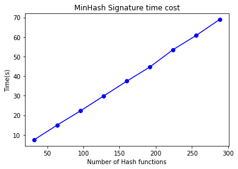

[Github Link](https://github.com/Ghostlikei/daseAlgo/blob/main/lab1/code/tools/lsh.ipynb)

## Project Overview

Similarity queries in high-dimensional spaces are crucial across various fields of data science, especially when handling massive datasets, such as images, audio, and graph-based nearest neighbor searches. One branch of research in querying focuses on Approximate Nearest Neighbor (ANN) search, and Locality Sensitive Hashing (LSH) is one of the most well-known methods for achieving high efficiency in time and space while maintaining high accuracy for high-dimensional data.

In class, we studied the basic LSH method, which involves computing MinHash signatures and grouping signatures into local segments. In academia, there have been numerous improvements to this method, with variations tailored to different distance metrics, such as the commonly used Euclidean distance, Minkowski distance, and Jaccard distance, which is used in this experiment.

The dataset we studied is an undirected graph based on co-authorship relationships. The project involves using Basic LSH and Multi-Probe LSH to estimate and compare the top ten nodes (or fewer if fewer exist) with the highest scores for Jaccard similarity (adjacency list) between the query node and all other nodes. The test results are then compared with the ground truth results (brute-force algorithm) to evaluate **recall rate**. Additionally, the time consumption for selecting different numbers of hash functions and other parameters is tested. Space consumption is directly computed based on the parameters, and through continuous debugging and adjustments, the optimal parameter ranges were determined.

## Problem Definition

- **Input**

The target input is the adjacency list of a graph $\mathbb{G}$. For a graph $\mathbb{G}$, the input is the adjacency list $\mathbf{Adj}(\mathbb{G})$, which includes the sequence of all nodes:

$$
X = <x_1, ..., x_n>
$$

and the edges connected to each node (excluding self-loops):

$$
Y_i = adjacent(x_i) = <x_k, ..., x_m>
$$

- **Output**

In this experiment, we use Jaccard similarity as the metric:

$$
\mathbf{sim}(x_i, x_j) = \mathbf{Jaccard}(Y_i, Y_j)
$$

The goal is to identify the top 10 nodes with the highest similarity to a target query node among all other nodes. Assuming the query node is $x_k$, the desired output is:

$$
m = \mathbf{sort}(\mathbf{sim}(x_k, x_j), x_j)[0:10], \quad j \in [0, n] \backslash \{j\}
$$

## Method

### Basic LSH

#### Construction of Hash Functions

Following the method described in the textbook, we use random permutation hashing. This involves generating a random, non-conflicting permutation and then, when hashing, directly taking the value at the corresponding index. This function requires defining the **input range** $n$ and the **output range** $m$, forming a mapping from $[0:n] \to [0:m]$.

This hash function is not only used for computing MinHash signatures but also for calculating the corresponding bucket values in LSH through cumulative summation.

```python
# The input of hash function should be range from 1 to n
# The output of hash will be range from 0 to m - 1
class PermHash:
    def __init__(self, n, m):
        self.max_number = n
        self.mod_number = m
        self.rand_permutation = np.random.permutation(n)
    
    def get(self, input):
        mapped_input = input % self.max_number + 1
        return self.rand_permutation[mapped_input - 1] % self.mod_number
```

#### Parameter Settings

For Basic LSH, the parameters to be set include:

- The number of hash functions used when computing MinHash signatures.
- The number of bands (partitions) used in Locality Sensitive Hashing.

The number of rows per band can be obtained by dividing the two.

```python
self.numHashes = numHashes            
self.numBands = numBands
self.rowOfBand = int(numHashes / numBands)
```

Since the MinHash signature matrix consumes the most space and time, for efficiency considerations, a fixed-size two-dimensional array in NumPy is used to accelerate access and modification.

```python
self.minHashSignature = np.zeros((numNodes, numHashes), dtype=int)
```

#### Computing MinHash Signatures

In the algorithm, for each node's adjacency list, each value computes $k$ hashes, and the minimum hash value is stored in the MinHash signature matrix. The initial maximum value is set to the maximum value of a 32-bit integer, which is sufficiently large (and the dataset won't reach such a scale).

- **Initialize the signature vector**:

```python
@timeit
def minHash(self):
    minhash = []
    for i in range(self.numHashes):
    minhash.append(1 << 31)
```

- **Compute $k$ hashes**: Replace the current value in the signature vector if the computed hash value is smaller.

```python
entry = int(temp[1])
for i in range(self.numHashes):
    result = self.permHashes[i].get(entry)
    # judge after permutation, whether the result is the minimum value
    if result < minhash[i]:
        minhash[i] = result
```

- **Insert into the signature matrix**: After computing the minimum hash values for all $k$ hashes, insert the result into the MinHash signature matrix and reinitialize the signature vector for the next node.

```python
for i in range(self.numHashes):
    self.minHashSignature[cnt - 1][i] = minhash[i]
    minhash[i] = 1 << 31
```

#### Signature Matrix Partitioning and Mapping

Now that we have computed the MinHash signature matrix, we need to partition the matrix into blocks. Each block is hashed into a corresponding bucket using one hash function, while recording the node information.

- **Initialize buckets**:

```python
self.bucketDict = []
    for i in range(kNumBuckets):
        self.bucketDict.append(set())
```

- **Partition the signatures and map nodes**: For each block, compute the sum of all rows within the block. Then use the previously defined random permutation hash function to map this sum into the corresponding bucket, effectively creating a mapping from $\mathbb{R}^n \mapsto \mathbb{R}$.

```python
for i in range(self.numNodes):
    row = self.minHashSignature[i]

    # divide the row into bands and hash each band to a bucket
    for bandIndex in range(self.numBands):
        bandStartIndex = bandIndex * self.rowOfBand
        bandEndIndex = (bandIndex + 1) * self.rowOfBand

        # calculate the hash value of the band and use it as the bucket key
        # Here, I use the sum of all r in one band
        sum = 0
        for ent in range(bandStartIndex, bandEndIndex):
            sum += self.minHashSignature[i][ent]
        bandHash = self.bucketHash.get(sum)
        bucketIndex = bandHash % kNumBuckets  # use both the band hash and row index to determine the bucket index

        # add the current node to the bucket
        self.bucketDict[bucketIndex].add(i)
```

#### Obtain Candidate Set and Estimate Similarity

With all the preparatory calculations completed, we can now use the generated buckets to perform the search.

The search process involves the following two steps:

1. Input a node and recompute all LSH bucket indices for it. Add all elements within these buckets to the **candidate set**. The principle is that if no hash mapping is the same, we can assume the similarity between the two sets is very low, and they will not be included in the final ranking.

- First, compute the target's set of indices

```python
# @timeit
def candidate(self, targetLine):
    # now we have built the bucketDict, let's find candidate pairs
    targetBucketIndices = set()
    for bandIndex in range(self.numBands):
        bandStartIndex = bandIndex * self.rowOfBand
        bandEndIndex = (bandIndex + 1) * self.rowOfBand

        # calculate the hash value of the band and use it as the bucket key
        # Here, I use the sum of all r in one band
        sum = 0
        for ent in range(bandStartIndex, bandEndIndex):
            sum += self.minHashSignature[targetLine][ent]
        bandHash = self.bucketHash.get(sum)
        bucketIndex = bandHash % kNumBuckets
        targetBucketIndices.add(bucketIndex)

```

- Obtain candidate set

If the target bucket contains no other elements, ignore the bucket. Otherwise, add all elements except itself to the candidate set.

```python
		candidate = set()

        for bucketIndex in targetBucketIndices:
            bucket = self.bucketDict[bucketIndex]

            if len(bucket) >= 2:
                # we have at least 2 nodes in this bucket, 
                # let's check all pairs of nodes in this bucket
                for node in bucket:
                    if node == targetLine:
                        continue
                    candidate.add(node)

        return candidate
```

2. For each element in the candidate set, estimate the Jaccard similarity by comparing the signature matrix (the mathematical expectation is the same, and the variance depends on the number and range of hash functions selected, as proven in the textbook). Finally, rank the candidate set.

- Define the estimated Jaccard function

```python
def jaccard(self, line1, line2):
        intersection = 0
        union = 0
        
        for i in range(self.numHashes):
            if self.minHashSignature[line1 - 1][i] 
            == 	self.minHashSignature[line2 - 1][i]:
                intersection += 1
                union += 1
            else:
                union += 2
        
        similarity = intersection / union
        return similarity
```

- Ranking

```python
testNode = 1
candidate = testEngine.candidate(testNode)

res = []
for each in candidate:
    tempJacc = testEngine.jaccard(testNode, each)
    res.append((tempJacc, each))

res.sort(reverse=True)
print("Top Nodes: ", end="")

for i in range(10):
    print(res[:10][i])
```

#### Time/Space Consumption Evaluation

When testing the correctness of the code, it was observed that the primary time consumption occurs during the computation of the hash signatures. Mathematically, this is also valid. Let's compute the time complexity and space consumption of the entire algorithm.

For the adjacency list of each node, the upper limit of input size is the total number of nodes $n$, and each element needs to compute $k$ hashes. Therefore, the time complexity is $O(kn)$, and the space complexity is $O(kn)$ since each MinHash signature needs storage.

For the LSH computation function, the $k$ hashes are divided into $b$ bands and mapped to the corresponding buckets. The time complexity is $O(\frac{kn}{b})$, and the space consumption is linearly related to the number of buckets $c$. However, since the size of the sets is uncertain, using a simple upper and lower bound estimation method introduces significant errors.

For the function to query the candidate set, the time complexity of the step to find the candidate set is constant (replace $n$ above with 1). However, the subsequent steps of computing and ranking depend on the specific size of the candidate set.

### Multi-Probe LSH

#### Introduction

In earlier tests, it was evident that only when many hash functions were used could the estimated Jaccard similarity achieve high accuracy compared to the actual results (under the condition of 1024 buckets and 4 rows per band, at least 256 hash functions were required for good estimation). However, increasing the number of hash functions significantly increases computational overhead because calculating the signature matrix is time-consuming. On the other hand, reducing the number of rows in a band enlarges the candidate set, which increases the cost of the candidate function.

To address this issue, researchers proposed several solutions. I chose and implemented one of the more straightforward methods: Multi-Probe LSH. The basic idea is as follows:

Instead of using a single hash function for LSH and maintaining many buckets, why not mimic the signature computation method by maintaining $m$ hash functions, resulting in $m$ columns of buckets? For an input node, $m$ hash functions are computed, and nodes corresponding to all $m$ indices are added to the candidate set.

Unlike Bloom filters, this is not stored in a single container. The $m$ hash functions and their results are entirely independent and do not map to the same bucket.

However, this method could lead to very small candidate sets (due to $m$ checks). To solve this problem, researchers proposed not probing a single bucket alone (for each bucket), but instead introducing a range, referred to as perturbation. For instance, if the target index is 3 and no elements exist in bucket 3, then buckets 2, 4, 1, and 5 are probed until the range limit is reached. This approach requires that the hash function used must be a **random permutation hash**.

#### Parameter Settings

The settings are the same as those in Basic LSH, with the addition of two extra parameters:

- The number of probes used during LSH computation
- The perturbation level (most studies suggest choosing values of 1 or 2)

```python
kProbes = 4
kPertube = 1
```

The process of computing MinHash signatures remains the same. The difference lies in the LSH portion.

#### Matrix Signature Partitioning and Multiple Mappings

For Multi-Probe LSH, the signature partitioning process is the same. The difference is that for each partition, $m$ hashes are computed to obtain indices, enabling multiple mappings.

```python
@timeit
def multiProbeLsh(self):
    # process signature matrix row by row
    for i in range(self.numNodes):
        row = self.minHashSignature[i]

        # divide the row into bands and hash each band to a bucket
        for bandIndex in range(self.numBands):
            bandStartIndex = bandIndex * self.rowOfBand
            bandEndIndex = (bandIndex + 1) * self.rowOfBand

            # calculate the hash value of the band and use it as the bucket key
            # Here, I use the sum of all r in one band
            sum = 0
            for ent in range(bandStartIndex, bandEndIndex):
                sum += self.minHashSignature[i][ent]

            for j in range(kProbes):
                bandHash = (self.bucketHashes[j]).get(sum)
                bucketIndex = bandHash % kNumBuckets  # use both the band hash and row index to determine the bucket index
                # add the current node to the bucket
                self.bucketTable[j][bucketIndex].add(i)
```

#### Get Candidate Index and Set

- First, for the input node, compute $m$ hashes for the corresponding row in the signature matrix to obtain the indices for each bucket.

```python
def candidate(self, targetLine):
        # now we have built the bucketDict, let's find candidate pairs
        targetBucketIndices = []
        for i in range(kProbes):
            targetBucketIndices.append(set())
        for bandIndex in range(self.numBands):
            bandStartIndex = bandIndex * self.rowOfBand
            bandEndIndex = (bandIndex + 1) * self.rowOfBand

            # calculate the hash value of the band and use it as the bucket key
            # Here, I use the sum of all r in one band
            sum = 0
            for ent in range(bandStartIndex, bandEndIndex):
                sum += self.minHashSignature[targetLine][ent]
            for j in range(kProbes):
                bandHash = (self.bucketHashes[j]).get(sum)
                bucketIndex = bandHash % kNumBuckets
                targetBucketIndices[j].add(bucketIndex)
```

- After obtaining the indices for each bucket, instead of probing a single bucket, perform a range probe based on the perturbation value.

Note that if the mapped index is 0, the algorithm needs to probe buckets at positions $n-1$, $n-2$, etc.

```python
candidate = set()

for j in range(kProbes):
    line = self.bucketTable[j]
    for target_idx in targetBucketIndices[j]:
        # Now we need to probe the range of each_idx based on the pertube value
        start = target_idx - kPertube
        end = target_idx + kPertube
        if start < 0:
            start = 0
            end = start + 2 * kPertube
        elif end >= kNumBuckets:
            end = kNumBuckets - 2
            start = end - 2 * kPertube

        rangeList = [p for p in range(start, end)]
        for each_idx in rangeList:
            bucket = line[each_idx]
            if len(bucket) >= 2:
                # we have at least 2 nodes in this bucket, let's check all pairs of nodes in this bucket
                for node in bucket:
                    if node == targetLine:
                        continue
                    candidate.add(node)

return candidate
```

With 64 hash functions, 4 probes, and a perturbation value of 1, Multi-Probe LSH achieves comparable results to Basic LSH with 256 hash functions, demonstrating its greater accuracy in candidate set selection.

## Experimental Results

### Accuracy Comparison

The most critical test in this experiment is the accuracy comparison between the estimated Top-10 set $A$ and the actual Top-10 set $Q$. Following the method in the paper, **recall rate** is used as the evaluation metric.

$$
recall =\frac{|A(q) \cap I(q)|}{|I(q)|}
$$

- Parameter Settings and Tested Parameters

Based on the analysis above, the tested parameter is the number of hash functions. The fixed parameters are as follows: the number of buckets is 4096 (the same for both methods), each band contains 4 rows of signatures, and for Multi-Probe LSH, the number of probes is 4 with a perturbation value of 1.

The test includes nodes with adjacency list lengths greater than 20 (to avoid large outliers, such as 18770 and 19771).

Systematic sampling is performed, starting from node 1 and selecting every 100th candidate node. A total of 60 nodes are tested, and the final result is the average recall rate.

The test range starts from 32 hashes, increasing by 32 at each step, with 9 total values tested for the number of hash functions.

- Result Plot


The red line represents Multi-Probe LSH, and the blue line represents Basic LSH.

Let us analyze this chart, as it is crucial in determining which metrics to test for time consumption later:

1. Analyzing the two lines individually, we can see that Multi-Probe LSH achieves good performance with very few hash functions. When the number of hash functions reaches around 128, it already achieves a highly accurate value, whereas Basic LSH requires over 256 hash functions to produce a similar structure.

2. Comparing horizontally, before the accuracy converges, Multi-Probe LSH achieves a similar recall rate with approximately half the number of hash functions required by Basic LSH. This demonstrates that Multi-Probe LSH can achieve comparable performance to Basic LSH with significantly fewer hash functions.

3. Comparing vertically, Basic LSH performs poorly when the number of hash functions is small, while Multi-Probe LSH achieves good results even with very few hash functions. For example, starting from the fourth test case in the chart, Multi-Probe LSH begins to converge.

#### Time Consumption Testing

- **Computing MinHash Signatures**

As emphasized earlier, the time consumption for computing the MinHash signature matrix is substantial. We will now test the time consumption for computing MinHash signatures under the same test cases and parameters, focusing on the relationship between the number of hash functions and time consumption.



Observing this chart, we can see that the time consumption has a linear relationship with the number of hash functions, consistent with the analysis.

When compared with the accuracy chart above, it is evident that to achieve the same recall rate, Multi-Probe LSH can reduce the number of hash functions required. This reduction is reflected in this chart as a decrease in the time consumed for computing the signature matrix.

- **Computing LSH**


Since multiple hash functions (4 in this case) are required to generate the corresponding indices, the overhead for Multi-Probe LSH increases. However, compared to the time consumption of computing the signature matrix, this additional time is relatively small.

This represents a **trade-off**, where the time for LSH computation and candidate generation is increased to reduce the number of hash functions (to achieve the same accuracy). Since the overhead for this step is much smaller, the strategy is to increase the number of hash functions here rather than during the computation of the signature matrix.

- **Computing Candidates**

Due to probing multiple indices, Multi-Probe LSH requires more effort compared to Basic LSH, which only probes the buckets corresponding to each band. Multi-Probe LSH not only probes the target bucket but also probes all buckets within the perturbation range, leading to significantly higher consumption in this step.

Below is the time consumption test for finding candidates for 60 nodes.


It is important to note that although the time consumption for this step increases, it is still negligible compared to the time spent computing the signature matrix (as this test is for 60 nodes). Therefore, Multi-Probe LSH indeed performs very well in terms of time efficiency.

#### Memory Consumption Testing

This aspect does not require testing since the memory usage for storing the signature matrix and LSH results is fixed and can be calculated precisely. The former is $k \times N$, and the latter depends on the number of buckets and the size of the sets, as mentioned in the earlier evaluation. Thus, no additional tests are conducted.

#### Other Parameters

Since the test dataset is limited to one, some parameters were chosen at relatively optimal scales after repeated adjustments. Drawing parameter-specific graphs would require more datasets, which is beyond the scope of this experiment. However, some thoughts and insights regarding the tested parameter selections are as follows:

For the number of bands and the rows per band, a range of 4–12 signatures per band worked well for this dataset size:

- Too small a dataset size results in high LSH time consumption and a lack of clear locality, as well as overly large candidate sets.
- Too large a dataset size also leads to poor locality evaluation, making it difficult to select the desired nodes in the candidate set and reducing ranking accuracy.

For the number of buckets, all tests in this report used 4096 buckets. For this dataset, the range of 2k–4k buckets provided good results:

- Reducing the bucket count below 1000 results in extremely poor accuracy (even with many hash functions).
- Excessive bucket counts consume too much memory and result in overly sparse distributions, significantly degrading Basic LSH performance.

For Multi-Probe LSH, using 4 probes and a perturbation value of 1 is sufficient for candidate set selection. Increasing these numbers further, such as setting the perturbation value to 2, leads to overly large candidate sets. This diminishes the filtering effectiveness of LSH itself (including most nodes and increasing the time consumption for estimating similarities). Thus, larger parameter values are not always better.

## Conclusion

This experiment implemented the Basic LSH and the improved Multi-Probe LSH methods, achieving promising results through parameter tuning and testing. However, there are still several areas for improvement:

- **Test Dataset**

If time permits, larger datasets should be generated to perform more comprehensive testing and parameter tuning on the entire algorithm engine (referred to as `LshEngine` in the code).

- **Candidate Scale**

It was observed that slight deviations in the number of bands or rows per band from the optimal range can cause the candidate set to either explode or shrink suddenly. The former leads to a sharp increase in time consumption, while the latter results in poor accuracy. A more refined strategy should be developed to automatically balance these two parameters based on the number of hash functions and the number of nodes in the graph, ensuring stable performance.

- **Implementation Issues**

Due to time constraints, this experiment used Python for programming. It was evident that computing hash signatures is a highly parallelizable and computationally intensive step. However, because of Python's Global Interpreter Lock (GIL), true concurrency could not be achieved. Instead, optimizations were limited to improving storage containers (e.g., using NumPy's fixed-size 2D arrays to speed up access). If tools supporting parallel processing and fast access, such as C-based languages, were used, the time consumption of the entire algorithm could be significantly reduced. Moreover, specialized computational units like GPUs could be employed to parallelize this step further.

- **Algorithmic Improvements**

Multi-Probe LSH remains a relatively basic algorithm with a brute-force approach to candidate set selection. Many advanced methods, such as Step-Wise LSH (which builds strategies on top of Multi-Probe to determine the step size for the next index selection), could further refine candidate selection. Additionally, certain optimizations for Euclidean distance-based methods (commonly used in image and video data) might also be adapted to this Jaccard similarity-based undirected graph.

Alternatively, incorporating more contextual information about the input data, such as relationships between institutions or affiliations, could better estimate the co-author connections.

## References

Lv, Q., Josephson, W., Wang, Z., Charikar, M., & Li, K. (2007, September). Multi-probe LSH: efficient indexing for high-dimensional similarity search. In *Proceedings of the 33rd international conference on Very large data bases* (pp. 950-961).

Jafari, O., Maurya, P., Nagarkar, P., Islam, K. M., & Crushev, C. (2021). A survey on locality sensitive hashing algorithms and their applications. *arXiv preprint arXiv:2102.08942*.

Khan, K. U. (2015, April). Set-based approach for lossless graph summarization using locality sensitive hashing. In *2015 31st IEEE International Conference on Data Engineering Workshops* (pp. 255-259). IEEE.