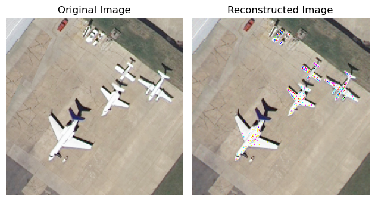
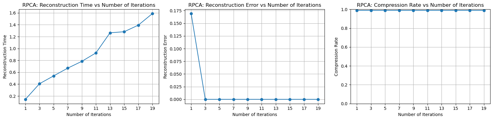

[Github Link](https://github.com/Ghostlikei/daseAlgo/blob/main/lab2/code/pca.ipynb)


## Abstract

For image datasets, PCA with SVD decomposition is a traditional lossy image compression algorithm. However, this algorithm struggles to handle images with significant components and sharp noise. Therefore, the robust PCA algorithm is introduced, achieving high compression rates, extremely low reconstruction errors, and rapid convergence within the same computation time, resulting in remarkable improvements.

## Project Overview

Compression algorithms based on eigenvalues are crucial in many fields because eigenvalues themselves are highly representative. Based on this concept, researchers have proposed numerous compression methods, with the most classic being PCA with SVD decomposition. By calculating the largest eigenvalues and selecting principal components, the original dataset is reconstructed. In class, we studied the mathematical proofs and basic forms of the algorithm.

The dataset we studied is a pixel image. The project focuses on reconstructing images using the classical PCA method and the improved Robust PCA method. The objective is to achieve the highest compression rate, the smallest reconstruction error, and the shortest compression time.

## Problem Definition

The data we need to compress in this project is an image set, represented as a 2D grid $G$, where each point contains three parameters corresponding to the RGB color channels, $G \in \mathbb{R}^{m\times n \times 3}$.

We need to perform **lossy compression** on the image information, evaluated by three criteria: reconstruction error, compression time, and compression rate.

Our goal is to minimize reconstruction error and compression time while maximizing the compression rate, requiring the support of relevant mathematical methods.

## Method

For the input matrix, since each point contains three elements, I "unfolded" this vector matrix into a two-dimensional form, flattening the three points into row vectors. As a result, the input matrix becomes a two-dimensional real-valued space $\mathbb{R}^{(m\times 3)\times n}$. After this transformation, the components of the matrix can be analyzed.

### Basic PCA

The most fundamental method follows the steps described in the textbook, which are as follows:

- Compute the centralized vector $\overline{\mathbf{x}}=\frac{1}{n} \sum_{i=1} \mathbf{x}_i$ and perform de-centering $\mathbf{y}_i=\mathbf{x}_i-\overline{\mathbf{x}}$.
- Construct a $d \times n$ matrix $Y=\left[\mathbf{y}_1, \mathbf{y}_2, \ldots, \mathbf{y}_n\right]$ and compute the $d \times d$ covariance matrix $C=\frac{Y Y^{\top}}{n-1}$.
- Perform orthogonal diagonalization of matrix $C$ (or SVD decomposition of matrix $Y$), assuming $\lambda_i$ corresponds to the eigenvector $\mathbf{u}_i$.
- Retain the eigenvectors corresponding to the top $k$ eigenvalues that are greater than $\alpha$.
- Perform dimensionality reduction and reconstruct the vector $\widehat{\mathbf{x}}_i=\left[\mathbf{u}_1, \ldots, \mathbf{u}_k\right]^{\top} \mathbf{x}_i$.

For this algorithm, the core idea is to assume that the input images possess certain characteristics. For instance, in Dataset 1, the characteristics of farmland images are quite distinct. The **eigenvector** corresponding to the **largest eigenvalue** can reconstruct the original image most effectively. This approach is believed to minimize the reconstruction error under a fixed compression ratio.

This method has only one parameter: the **number of principal eigenvalues** to select.

The following is the implementation code:

Step 1: Load the image and unfold it into a two-dimensional matrix.

```python
class BasicPCAEngine:
    def __init__(self, img_path):
        self.img_path = img_path
  
    # @timeit
    def load_img(self):
        self.image = imageio.imread(self.img_path)
        # Convert the image matrix to a 2D matrix
        self.image_2d = self.image.reshape(self.image.shape[0]*self.image.shape[2], 	self.image.shape[1])
```

Step 2: Obtain the covariance matrix and compute the eigenvalues.

At this step, the key part is calculating multiple eigenvalues. In Basic PCA, my implementation uses the most fundamental **power method**. For each iteration, after calculating an eigenvalue $\lambda_i$ and its corresponding eigenvector $x_i$, the original covariance matrix is updated by subtracting the outer product of the eigenvector and the scalar multiple of the eigenvalue:

$$
C_{i+1}=C_i-\lambda_i(x_ix_i^T)
$$

In this way, the next largest eigenvalue $\lambda_{i+1}$ can be computed.

```python
@timeit
def pca(self):
    # Step 1: Calculate the decentralized matrix Y
    self.mean_vector = np.mean(self.image_2d, axis=0)
    self.decentralized_matrix = self.image_2d - self.mean_vector

    # Step 2: Calculate the covariance matrix C
    covariance_matrix = np.cov(self.decentralized_matrix.T)

    # Step 3: Calculate the eigenvalues and eigenvectors of the covariance matrix
    eigenvalues = []
    eigenvectors = []

    for i in range(covariance_matrix.shape[0]):
        eigenvalue, eigenvector = self.basic_eigen(covariance_matrix)
        eigenvalues.append(eigenvalue)
        eigenvectors.append(eigenvector)

        # Deflate the covariance matrix
        covariance_matrix -= eigenvalue * np.outer(eigenvector, eigenvector)

    # eigenvalues, eigenvectors = np.linalg.eig(covariance_matrix)

    eigenvalues = np.array(eigenvalues)
    eigenvectors = np.array(eigenvectors)

    self.eigenvalues = eigenvalues
    # self.eigenvectors = eigenvectors
    self.eigenvectors = eigenvectors.T
```

Improvements to this power method will be discussed later. For now, we focus on implementing the algorithm itself. Below is the function for calculating a single eigenvalue and eigenvector using the basic power method.

```python
def basic_eigen(self, mat, num_iterations=1000, tol=1e-6):
    # Initialize a random vector
    v = np.random.rand(mat.shape[0])

    for _ in range(num_iterations):
        # Perform matrix-vector multiplication
        v_new = np.dot(mat, v)

        # Normalize the vector
        v_new /= np.linalg.norm(v_new)

        # Calculate the eigenvalue estimate
        eigenvalue = np.dot(v_new.T, np.dot(mat, v_new))

        # Check for convergence
        if np.abs(eigenvalue - np.dot(v.T, np.dot(mat, v))) < tol:
            break

        # Update the vector
        v = v_new

    # Calculate the eigenvector
    eigenvector = v

    return eigenvalue, eigenvector
```

Step 3: Select the number of principal eigenvalues and reconstruct the matrix.

For the selected number of eigenvalues, use their corresponding eigenvalue-eigenvector pairs. Multiply these with the original de-centered matrix and add back the mean. Finally, ensure to reassemble the two-dimensional matrix into its original high-dimensional form. This completes the reconstruction process.

```python
@timeit
def reconstruct(self, num_components):
    # Step 4: Select the significant eigenvectors and eigenvalues
    self.selected_eigenvectors = self.eigenvectors[:, :num_components]
    self.selected_eigenvalues = self.eigenvalues[:num_components]

    # Step 5: Reconstruct the vector for each principal component
    self.reconstructed_vectors = np.dot(self.decentralized_matrix, self.selected_eigenvectors)

    # Step 6: Reconstruct the matrix
    self.reconstructed_image_2d = np.dot(self.reconstructed_vectors, self.selected_eigenvectors.T) + self.mean_vector
    self.reconstructed_image = self.reconstructed_image_2d.reshape(self.image.shape)
```

### Discussion on Testing Results and Improvement Methods

Having completed the most basic version of PCA, it is noticeable that, based on the decorator results for computing eigenvalues and reconstruction, the eigenvalue computation function consumes the majority of the time. This is due to the repeated vector-matrix multiplications, whereas the reconstruction part involves a finite number of matrix multiplications, and its time consumption can be considered negligible.

The principle of compression ratio calculation is as follows: the total size of elements required for reconstruction in the algorithm consists of:

- The sliced de-centered matrix,
- The sliced eigenvector set,
- The number of eigenvalues.

Adding these together and dividing by the size of the entire image gives the compression ratio of the algorithm.

```python
def compress_rate(self):
        component_sizes = self.selected_eigenvectors.size + self.selected_eigenvalues.size + self.reconstructed_vectors.size
  
        # Calculate the compression rate
        rate = component_sizes / self.image.size
        return 1 - rate
```

For reconstruction error, the comparison involves the squared difference between the two-dimensional unfolded form of the original image and the two-dimensional form of the reconstructed image. This is similar to the definition in the textbook. Of course, mean squared error (MSE) can also be used as a metric by simply dividing the result by the total number of pixels.

```python
def reconstruct_err(self):
    return np.linalg.norm((self.image_2d - self.reconstructed_image_2d)**2)
```

Regarding the performance of compression ratio and reconstruction error, let's first examine a reconstruction comparison image (with 100/256 principal components):

Reconstruction Error: 12871.7020

Compression Ratio: 0.4787



From the reconstructed image, a significant issue can be clearly observed: the airplane, being a very prominent element in the entire image, has a white color that contrasts sharply with the background. According to the assumptions of the basic PCA method, this image is difficult to represent using simple eigenvalues and eigenvectors. As a result, in the reconstructed image, there are very discordant **monochrome spots** on the white body of the airplane. However, the number of selected principal components is already quite high, and even testing with more principal components cannot effectively resolve this issue (the compression ratio here is already very low, only 47.87%). Therefore, for the basic PCA assumptions, we need to introduce additional methods to handle such cases, as the assumptions are overly simplistic.

**Test Results for Three Datasets**

The number of principal components tested is `range(1, 51, 5)`.


The reconstruction time remains relatively stable, and the compression ratio has a linear relationship with the number of principal components selected. However, the rate of decrease in reconstruction error keeps slowing down. I believe this is because the method cannot effectively address the issue of noise.

In summary, the objective of the experiment is to resolve the noise on the airplane while ensuring a high compression ratio and relatively low computation time. For this purpose, researchers have proposed an excellent solution: the Robust PCA method.

### Robust PCA

Candès, E. J., Li, X., Ma, Y., & Wright, J. (n.d.). Robust principal component analysis? Microsoft Research Asia 2009 Retrieved from https://statweb.stanford.edu/~candes/papers/RobustPCA.pdf

Researchers believe that the reconstructed image can be decomposed into the sum of the following two components:

- A low-rank matrix
- A sparse matrix: a matrix representing sharp noise

The entire problem can be understood as an optimization problem: minimizing the sum of the rank of the low-rank matrix and the number of sharp noise elements.

However, the rank function itself is not a convex function, so the **nuclear norm** (the L1 norm of singular values) is used as a substitute. This reformulation allows the original problem to be expressed as a convex optimization problem: 

$$
\begin{array}{ll}
\operatorname{minimize} & \|L\|_*+\lambda\|S\|_1 \\
\text { subject to } & L+S=M
\end{array}
$$

This results in a linear-constrained optimization problem, which can be solved directly using solvers. However, the convergence speed for optimizing the nuclear norm and sparse matrix is very slow. The nuclear norm requires **shrinking** to compute singular values, which has a complexity comparable to SVD decomposition. The paper introduces an **Augmented Lagrange Multiplier (ALM) method**, which iteratively optimizes RPCA. This approach incorporates a shrinking multiplier and truncated SVD decomposition to accelerate optimization. 

Algorithm:


Here is my code:
```python
class RPCAEngine:
  @timeit
  def reconstruct(self, num_iter = 100):
      rpca = R_pca(self.image_centered)
      L, S = rpca.fit(max_iter=num_iter, iter_print=10)
      self.reconstructed_image = L + self.mean_vector + S

      self.reconstructed_image = 			self.reconstructed_image.reshape(self.image.shape)
      self.L = L.reshape(self.image.shape)
      self.S = S.reshape(self.image.shape)
```

```python
class R_pca:
		# ...
    @staticmethod
    def shrink(M, tau):
        return np.sign(M) * np.maximum((np.abs(M) - tau), np.zeros(M.shape))
      
    def svd_threshold(self, M, tau):
        U, S, V = self.mysvd(M, full_matrices=False)
        return np.dot(U, np.dot(np.diag(self.shrink(S, tau)), V))

    def fit(self, tol=None, max_iter=1000, iter_print=100):
        iter = 0
        err = np.Inf
        Sk = self.S
        Yk = self.Y
        Lk = np.zeros(self.D.shape)

        if tol:
            _tol = tol
        else:
            _tol = 1E-7 * self.frobenius_norm(self.D)

        while (err > _tol) and iter < max_iter:
            Lk = self.svd_threshold(self.D - Sk + self.mu_inv * Yk, self.mu_inv)
            Sk = self.shrink(self.D - Lk + (self.mu_inv * Yk), self.mu_inv * self.lmbda)
            Yk = Yk + self.mu * (self.D - Lk - Sk)
            err = self.frobenius_norm(self.D - Lk - Sk)
            iter += 1
            if (iter % iter_print) == 0 or iter == 1 or iter > max_iter or err <= _tol:
                print('iteration: {0}, error: {1}'.format(iter, err))

        self.L = Lk
        self.S = Sk
        # print("RPCA Iter: ", iter)
        return Lk, Sk
```

The implementation is consistent with the algorithm described above. The algorithm includes a hyperparameter $\mu=1e-7$, which, after several adjustments, was found to be the optimal magnitude. Another parameter is the **number of iterations**, which limits the maximum number of iterations unless the algorithm has already converged.

#### Test Results

Running test cases reveals that this algorithm performs exceptionally well. To demonstrate the decomposition effect, I visualized both the low-rank matrix $L$ and the sparse matrix $S$. Below are the results for a maximum of 50 iterations, adjusted to match the computation time of the Basic PCA reconstruction above.

Reconstruction Error: 1.153317020970679e-06

Rank of the Low-Rank Matrix: 3


It can be observed that this method effectively eliminates the sharp noise issue present in BPCA while achieving an exceptionally high compression ratio (only 3, out of a total of 256 rows).

Next, we perform the same type of test as above, with the number of iterations tested as `range(1,21,2)`. Due to the outstanding performance, it is almost impossible to compare the two methods side by side.

Of course, the reconstruction error is calculated in the same way as before. For the compression ratio, it is computed as the rank of the low-rank matrix divided by the total number of rows, plus the number of sharp noise elements (which is extremely small and can almost be ignored).




## Conclusion

In this experiment, we implemented the Basic PCA and the improved Robust PCA methods, achieving excellent results. However, there are still several areas for improvement:

- **Test Dataset**

The dataset could include larger images or images with varying clarity and noise levels. This would provide a better evaluation of RPCA's performance.

- **Mathematical Proof of the Optimization Algorithm**

Due to the high mathematical complexity of the paper, there was no time to derive the entire mathematical process of the RPCA ALM algorithm during the implementation. Performing such a derivation would lead to a deeper understanding (although the difficulty is indeed very high).

- **Mathematical Issues in the Optimization Algorithm**

This algorithm differs slightly from the classical Lagrange multiplier optimization method. Specifically, the two operators $M$ and $Y$ in this algorithm are not independent of each other, which makes relaxation particularly challenging. In the final section of the paper, the authors proposed a possible improvement: in addition to decomposing the original image $M$ into a low-rank matrix $L$ and a sparse matrix $S$, they introduced a **dense perturbation matrix** $N$. This dense matrix aims to separate dense noise (different from sparse noise). This idea is highly feasible and, for larger datasets, could further reduce the rank of the low-rank matrix and enhance the effectiveness of the sparse noise. The optimization function can be reformulated as follows:
$$
M=\mathcal{A}\left(L_0\right)+\mathcal{B}\left(S_0\right)+\mathcal{C}\left(N_0\right)
$$
It is even possible to combine RPCA with traditional PCA or other PCA methods.
