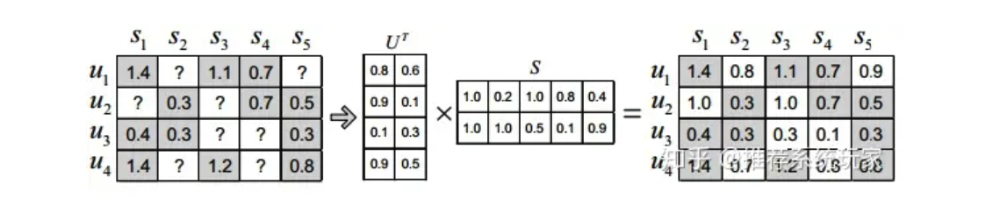
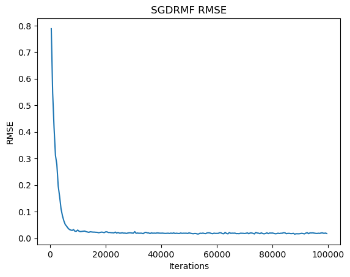

[Github Link](https://github.com/Ghostlikei/daseAlgo/blob/main/lab3/code.ipynb)

## Project Overview

Recommendation systems based on rating matrices have been one of the most critical problems in the field of recommendation algorithms. Starting with simple SVD decomposition, the industry has continuously improved and proposed numerous algorithms for recommendation using matrix factorization and related information over the past few decades. In 2006, Netflix organized the Netflix Prize, which significantly boosted the development of recommendation algorithms, leading to the birth of milestone algorithms like Funk SVD. Since then, research in rating matrix-based recommendation algorithms has primarily focused on the following three directions:

- Recommendation algorithms based on eigenvalue computation derived from the SVD algorithm
- Gradient Descent Matrix Factorization (GDMF)
- Probability-based algorithms, such as Bayesian estimation, leading to Probabilistic Matrix Factorization (PMF)

In this project, we focused on the second type, gradient descent-based matrix factorization algorithms. I selected a dataset with a scale of 100,000 users and 30,000 items for clothing rental ratings to implement the algorithm. During practical operations, this dataset exhibits both sparsity and a large scale, which imposes high demands on the **convergence** and **efficiency** of the algorithm.

## Problem Definition

The input to the problem is an original user-item rating matrix $M$, which is a sparse matrix.

The output is two factorized matrices $P$ and $Q$, whose inner product yields the predicted rating matrix. This matrix will be used for actual recommendations.



Matrix factorization algorithms decompose an $m \times n$ matrix $R$ into the product of a user matrix $U$ of size $m \times k$ and an item matrix $S$ of size $k \times n$. Here, $m$ is the number of users, $n$ is the number of items, and $k$ is the dimension of the **latent factor**. The size of $k$ determines the expressive power of the latent factor, and its value is usually determined through multiple experiments. Once the user matrix $U$ and item matrix $S$ are obtained, multiplying these two matrices results in a full-rank matrix. This allows us to predict ratings for items that have not yet been rated. The predicted ratings can then be sorted and recommended to users. This is the most fundamental application of matrix factorization in recommendation systems.

In simple terms, matrix factorization is used to **predict missing ratings**.

## Method

The derivation and steps of the algorithm were thoroughly covered in class and will not be discussed here. The following sections focus on understanding the algorithm, implementing it, selecting parameters, and discussing its performance.

### Data Preprocessing

The dataset comes from a clothing rental website, "Rent the Runway." Below is a sample of the raw JSON data:

```json
{"fit": "small", "user_id": "958237", "bust size": "34b", "item_id": "181453", "weight": "125lbs", "rating": "8", "rented for": "party", "review_text": "Very tight through the hips, and you need to have at least a c cup for the bodice to fit properly. ", "body type": "athletic", "review_summary": "I received numerous compliments on the dress!", "category": "dress", "height": "5' 6\"", "size": 12, "age": "44", "review_date": "January 17, 2013"}
```

For the algorithm to be implemented in this project, the data required includes only the user, item, and rating as the basis for recommendations. The first two are directly mapped to arrays, resulting in a dataset with ratings. Missing ratings are recorded as 0, while unrated items are filled with the median value of 8.

```python
def preprocess_json(json_file):
    user_ids = []
    item_ids = []
    ratings = []

    with open(json_file) as f:
        cnt = 0
        for line in f:
            cnt += 1
            if cnt % 4 != 0:
                continue
            entry = json.loads(line)

            user_ids.append(entry["user_id"])
            item_ids.append(entry["item_id"])
            rating = entry.get("rating")
            if rating is not None:
                ratings.append(float(rating))
            else:
                ratings.append(NONE_RATING)
            

    user_ids = np.array(user_ids)
    item_ids = np.array(item_ids)
    ratings = np.array(ratings)

    unique_user_ids = np.unique(user_ids)
    unique_item_ids = np.unique(item_ids)

    user_index = {user_id: index for index, user_id in enumerate(unique_user_ids)}
    item_index = {item_id: index for index, item_id in enumerate(unique_item_ids)}

    matrix = np.zeros((len(unique_user_ids), len(unique_item_ids)))

    for user_id, item_id, rating in zip(user_ids, item_ids, ratings):
        user_idx = user_index[user_id]
        item_idx = item_index[item_id]
        matrix[user_idx, item_idx] = rating

    return matrix
```

### Basic MF

- **Algorithm Understanding**

This algorithm is the most basic form of an unconstrained optimization problem for matrix factorization, derived as an iterative algorithm using gradient descent:

$$
\min _{\boldsymbol{P}, \boldsymbol{Q}}\left\|\boldsymbol{R}-\boldsymbol{P} \boldsymbol{Q}^{\mathrm{T}}\right\|
$$

However, the Hessian matrix of this objective function is indefinite, meaning the objective function is **non-convex**, which can lead to issues such as **overfitting**, vanishing gradients, or exploding gradients.

During the practical implementation of this algorithm for processing 100,000 entries, the following problems were encountered:

1. The vanishing or exploding gradient issue mentioned above is severe with inappropriate learning rate parameter selection, leading to situations where the data becomes static or diverges to infinity (`inf`) or `nan`.

2. The fitting performance for sparse matrices is poor, and the learning efficiency is low.

3. Tuning the parameters is excessively challenging, and finding a suitable learning rate parameter to resolve these issues proved infeasible.

As a result, this algorithm was eventually abandoned and replaced in the code by the next optimization scheme: Regularized Matrix Factorization.

### Regularized MF

As in the textbook, the L2 norm is used as the regularization term, and a regularization parameter is introduced. The original optimization problem is modified as follows:

$$
\min _{\boldsymbol{P}^*, \boldsymbol{Q}^*} J(\boldsymbol{R} ; \boldsymbol{P}, \boldsymbol{Q})=\frac{1}{2}\left[\sum_{(u, i) \in \mathbf{K}} e_{u i}^2+\lambda\left(\|\boldsymbol{P}\|_F^2+\|\boldsymbol{Q}\|_F^2\right)\right]
$$

By computing the gradient of the objective function, we derive the update formulas:

$$
\begin{array}{r}
p_{u j}^{(t+1)} \leftarrow p_{u j}^{(t)}+\epsilon\left(\sum_{i:(u, i) \in \mathbf{K}} e_{u i}^{(t)} q_{j i}^{(t)}-\lambda p_{u j}^{(t)}\right) \\
q_{j i}^{(t+1)} \leftarrow q_{j i}^{(t)}+\epsilon\left(\sum_{u:(u, i) \in \mathbf{K}} e_{u i}^{(t)} p_{u j}^{(t)}-\lambda q_{j i}^{(t)}\right)
\end{array}
$$

where $e_{u i}^{(t)}=r_{u i}-\sum_{j=1}^{\mathbf{K}} p_{u j}^{(t)} q_{j i}^{(t)}$.

One common mistake in the code is handling the temporary storage of $p_{uj}$. Since $p$ is first updated using $q$, and then $q$ is updated using $p$, the array representing $p$ before the update must be stored in advance. Otherwise, during the update of $q$, the algorithm would use the newly iterated $p$ array, leading to inconsistencies with the original algorithm. This error took a significant amount of time to identify and resolve.

```python
def matrix_factorization(matrix, k, epsilon, lambd, iterations, threshold = 1e-4):
    num_users, num_items = matrix.shape

    # Initialize P and Q matrices with random values
    P = np.random.rand(num_users, k)
    Q = np.random.rand(k, num_items)

    check(P)
    check(Q)

    print(P, Q)

    current_loss = 0.0

    for _ in range(iterations):
        for i in range(num_users):
            print("Peeking row: ", i)
            for j in range(num_items):
                if matrix[i, j] != 0.0:
                    error = matrix[i, j] - np.dot(P[i, :], Q[:, j])
                    # print("error: ", error)
                    if np.isnan(error):
                        print("NAN DEBUG INFO")
                        print(f"P[{i}]", P[i, :])
                        print(f"Q[{j}]", Q[:, j])
                        print(f"mat[{i}][{j}]: ", matrix[i][j])


                    for l in range(k):
                      	temp = P[i, l]
                        P[i, l] += epsilon * ((2 * error * Q[l, j]) - lambd * P[i, l])
                        Q[l, j] += epsilon * ((2 * error * temp) - lambd * Q[l, j])

        # Calculate current loss
        predicted_matrix = np.dot(P, Q)
        current_loss = calculate_rmse(matrix, predicted_matrix)
        print("Loss: ", current_loss)

        if current_loss <= threshold:
            break

    return P, Q
```

- **Parameter Settings and Evaluation Criteria**

After continuous parameter adjustments, the following insights were gained:

- $k$ does not need to be very large; a value of 10 is sufficient to effectively represent the relationships between ratings, items, and users.
- A learning rate $\epsilon$ that is too large causes overfitting and gradient explosion issues, while a learning rate that is too small results in slow convergence. Empirically, values of 0.01 or 0.005 were found to be appropriate.
- The regularization parameter $\lambda$ is most suitable in the range of 0.001 to 0.01, which aligns with findings in the literature.

The evaluation criterion for the model's accuracy is RMSE (Root Mean Squared Error). Since the matrix is sparse, unrated entries are excluded from the RMSE calculation.

```python
def calculate_rmse(original, reconstructed, loc):
    # Calculate the squared differences
    error = 0
    for i, j in loc:
        error += (original[i, j] - reconstructed[i, j]) ** 2
    
    # Calculate the RMSE
    rmse = np.sqrt(error)
    
    return rmse
```

- **Test Results and Improvement Directions**

After continuous parameter adjustments with $k=10$, a learning rate of 0.01, and a regularization parameter of 0.01, the model worked correctly and consistently reduced the RMSE. However, it encountered severe efficiency issues:

1. The original matrix is a **sparse matrix**, with non-zero entries comprising **less than 1%** of the total million-level entries. Accessing and checking whether each element is zero for every iteration requires optimization of this seemingly simple step. In essence, traversal alone consumes significant time.

2. Some entries in the $P$ and $Q$ matrices achieve excellent fitting results and no longer require additional iterations, while others require thousands of iterations to converge. The simple RMF approach accesses every entry in the original matrix uniformly during each iteration. For large-scale data, applying gradient descent to all elements is an inefficient strategy.

In practice, with the current learning rate, convergence requires hundreds of thousands of iterations. Such computation would take more than an entire day. Therefore, the textbook proposes a potential improvement strategy: **Stochastic Gradient Descent (SGD).**

For a low-compute personal laptop without a GPU, the second issue mentioned above is the main bottleneck of the algorithm. Many survey papers suggest various optimization methods leveraging additional information, but I believe that implementing stochastic gradient descent is the most practical improvement for a dataset with 100,000 entries. Otherwise, the time per iteration is prohibitively long.

### SGD MF

A promising idea is to randomly select one entry from the original matrix to compute the gradient during each step. While this may temporarily increase error, it significantly improves learning efficiency. In practical tests, the optimization effect was extremely noticeable. Below are the implementation code and corresponding strategies:

- **Handling Sparse Matrices**

Since zero entries do not need to be fitted by $P$ and $Q$, randomly selecting combinations from the non-zero entries during gradient computation can greatly improve efficiency. Of course, these combinations need to be identified first.

```python
def check(matrix):
    row, col = matrix.shape
    print("Shape: ", matrix.shape)

    cnt = 0
    non_zero_ret = []
    for i in range(row):
        print("Peeking row: ", i)
        for j in range(col):
            if matrix[i, j] != 0:
                print("None zero element: ", matrix[i, j])
                non_zero_ret.append((i, j))
                cnt += 1
    print("None zero elements: ", cnt)

    return non_zero_ret

non_zero_location = check(matrix)
```

With these combinations, we can implement random selection for non-zero entries, resulting in a regularized matrix factorization algorithm based on SGD.

```python
def sgd(matrix, location, k, epsilon, lambd, iterations, threshold=1e-4):
    num_users, num_items = matrix.shape

    # Initialize P and Q matrices with random values
    P = np.random.rand(num_users, k)
    Q = np.random.rand(k, num_items)

    current_loss = 0.0

    for _ in range(iterations):
        i, j = random.choice(location)

        if matrix[i, j] == 0.0:
            raise ArithmeticError

        # print("Peeking row:", i)

        error_ij = matrix[i, j] - np.dot(P[i, :], Q[:, j])

        for l in range(k):
            temp_p = P[i, l]
            P[i, l] += epsilon * (2 * error_ij * Q[l, j] - lambd * P[i, l])
            Q[l, j] += epsilon * (2 * error_ij * temp_p - lambd * Q[l, j])

        # Calculate current loss
        if _ % 500 == 0 :
            predicted_matrix = np.dot(P, Q)
            current_loss = calculate_rmse(matrix, predicted_matrix, location)
            print(f"Iteration {_}, RMSE: ", current_loss)

        if current_loss <= threshold:
            break

    return P, Q
```

Using the same learning rate and regularization parameters, selecting only 100,000 random directions for descent was sufficient to achieve a nearly convergent RMSE. This computation is **equivalent to just a few iterations of RMF without SGD**.

```bash
Iteration 0, RMSE:  7.6396972796166365
Iteration 100, RMSE:  0.3263567310600485
Iteration 200, RMSE:  0.2623667441533053
Iteration 300, RMSE:  0.22133393357334233
Iteration 400, RMSE:  0.1652960734891707
Iteration 500, RMSE:  0.17035731568170875
Iteration 600, RMSE:  0.15244996868499497
Iteration 700, RMSE:  0.21359804709659458
Iteration 800, RMSE:  0.16554754857984894
Iteration 900, RMSE:  0.14787932391505634
Iteration 1000, RMSE:  0.15067395154281074
Iteration 1100, RMSE:  0.11908385540869247
Iteration 1200, RMSE:  0.12859355751377202
...
Iteration 99900, RMSE:  0.014759398044224955
```

The results were excellent. Due to the large scale of the original dataset, a smaller dataset was used to visualize the precision of stochastic gradient descent. The precision plot shows some fluctuations but demonstrates very rapid convergence.



### Application in Recommendation

The recommendation is generated by taking the inner product of the corresponding row in $P$ and the column in $Q$. After removing items that have already been rated, the top $N$ items with the highest scores are recommended.

```python
def recommend_items(user_id, recommend_num, P, Q, rated_items):
    user_idx = user_id - 1  # Adjust user_id to zero-based index

    # Calculate predicted ratings for the user
    user_ratings = np.dot(P[user_idx, :], Q)

    # Exclude the rated items
    unrated_items = np.where(rated_items[user_idx, :] == 0)[0]
    user_ratings[unrated_items] = -np.inf

    # Get top-rated item indices
    top_indices = np.argsort(user_ratings)[::-1][:recommend_num]

    # Adjust item indices to one-based index
    top_indices += 1

    items = list(top_indices)
    print(f"Recommendation result: user_id: {user_id}, items: {items}")

    return list(top_indices)

items = recommend_items(1, 10, Pm, Qm, matrix)
```

Recommendation Results: Taking user with ID = 1 as an example, 10 items are recommended. For each request, recommendations are computed for the corresponding user. Compared to the earlier gradient descent process, this step requires negligible computation time.

```bash
Recommendation result: user_id: 1, items: [908, 4976, 1661, 1655, 1656, 1657, 1658, 1659, 1660, 1662]
```

## Conclusion

This experiment implemented the regularized gradient descent matrix factorization method and significantly improved computational efficiency using stochastic gradient descent. It achieved excellent recommendation results with high accuracy and fast convergence. However, there are many potential directions for improving gradient descent itself:

- **Community Detection for Clustering**: Implementing user clustering through community detection algorithms could enable block-wise computation of the matrix, increasing the efficiency of information utilization (especially effective for large-scale data, as noted in research papers).

- **Incorporating Additional User Data**: The dataset includes information about users' height, weight, and clothing sizes. These attributes could be integrated to further model user features, enabling more precise recommendations.

- **Leveraging High-Performance Machines**: Using machines with higher computational power and parallel computing units (e.g., GPUs) for iterative gradient descent could drastically reduce computation time. This step is the most time-consuming yet highly parallelizable. The algorithms discussed above would benefit greatly from high-performance machines, especially for large-scale datasets like the one used in this experiment. For datasets in real-world applications, often tens of gigabytes in size or larger, personal computers are insufficient to support such computations.

## References
Takács, G., Pilászy, I., Németh, B., & Tikk, D. (2008, August). Investigation of various matrix factorization methods for large recommender systems. In *Proceedings of the 2nd KDD Workshop on Large-Scale Recommender Systems and the Netflix Prize Competition* (pp. 1-8).